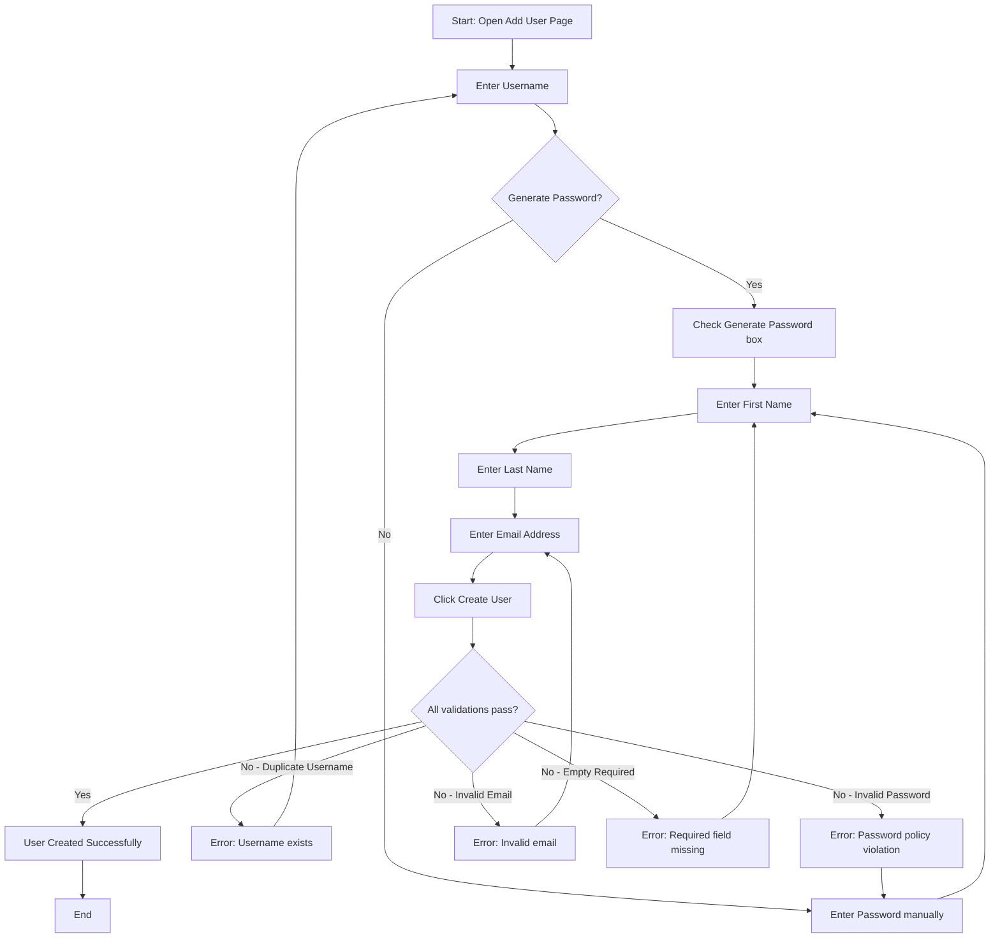
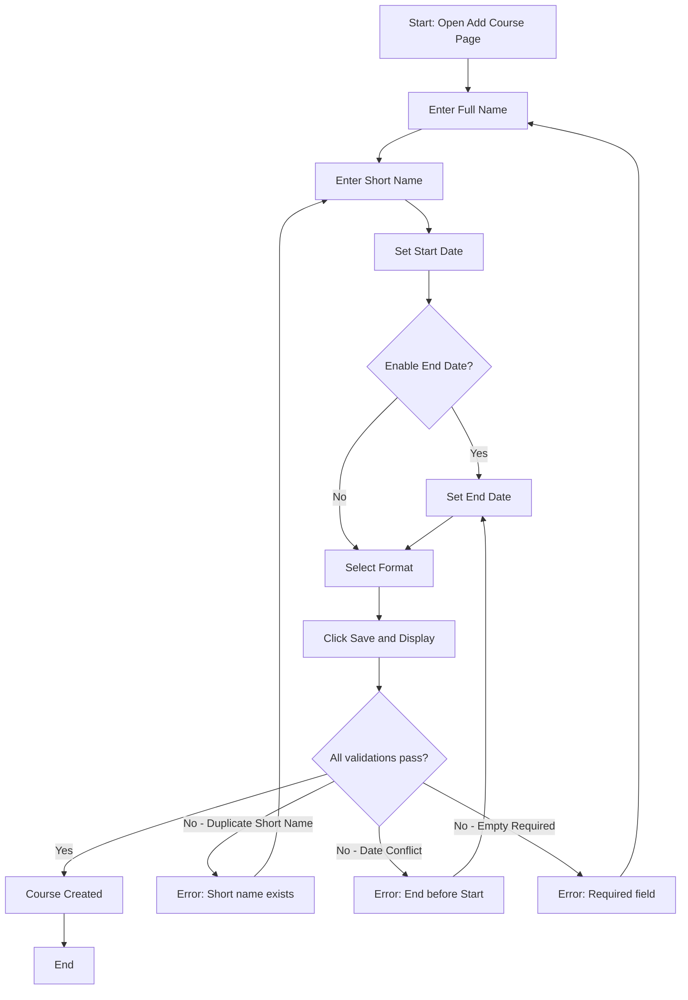
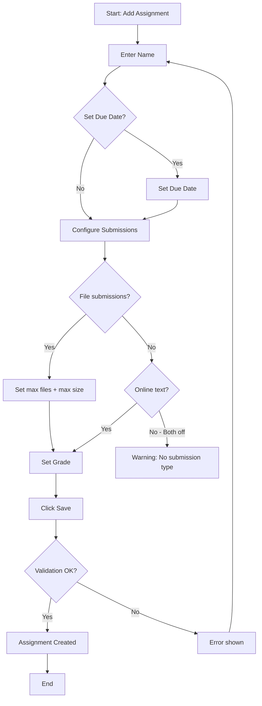
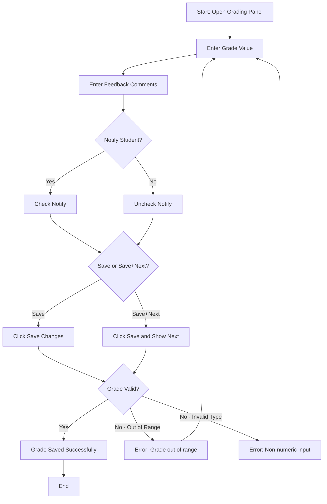
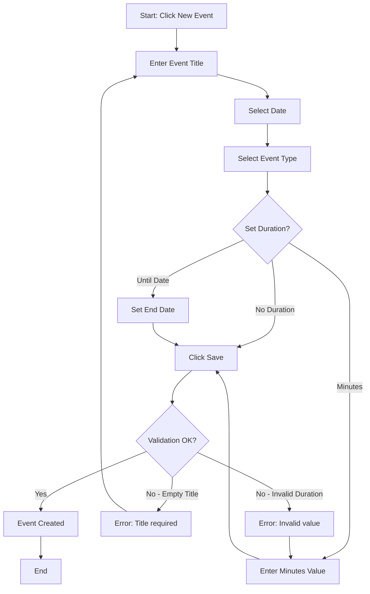
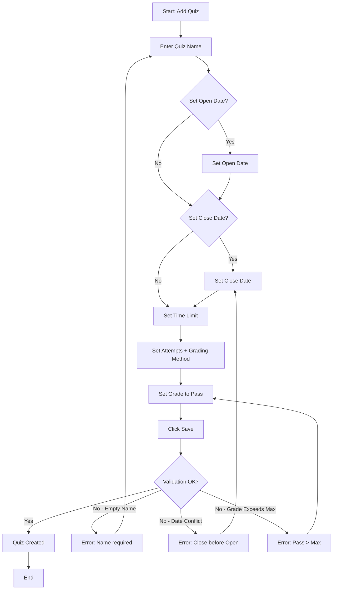

# Software Testing – Project 2: Black-box Testing Report

**Course:** Software Testing  
**Semester:** 2 - Year 2025-2026  
**Group name:** *(To be filled)*  
**Class:** *(To be filled)*  
**Product:** Mount Orange University — `https://school.moodledemo.net/`

---

## Group Members & Task Assignments

| No. | Family Name | First Name | Student ID | Role | Contribution (%) | Tasks |
|-----|-------------|------------|------------|------|------------------|-------|
| 1   |             |            |            |      |                  | Feature 001, 002 |
| 2   |             |            |            |      |                  | Feature 003, 004 |
| 3   |             |            |            |      |                  | Feature 005 |
| 4   |             |            |            |      |                  | Feature 006 |

---

## AI Tools Disclosure

This project used **Antigravity (Google Gemini-based AI agent)** to assist with:
- Exploring the Mount Orange website via automated browser agents.
- Drafting initial test case structures and report formatting.
- All generated content was reviewed, verified, and hand-edited by team members.

---

# Feature 001: Admin Adds a New User

## 1.1 Feature Description

The Site Administration module allows managers to manually create new user accounts in the Moodle system. The form includes multiple input fields with validation rules.

**Execution Flow:**
1. Log in as `manager` (credentials from login page).
2. Navigate to **Site administration > Users > Add a new user**.
3. Fill in the required and optional fields.
4. Click **Create user**.

## 1.2 Form Fields Catalog (from browser exploration)

| Field | Type | Required | Constraints / Rules |
|-------|------|----------|---------------------|
| Username | Text input | Yes | Lowercase letters, digits, hyphens, underscores, periods, @. No spaces. Must be unique. |
| Authentication method | Dropdown | Yes | Default: "Manual accounts". Options: Manual, Email-based self-registration, etc. |
| Suspended account | Checkbox | No | Default: unchecked |
| Generate password and notify user | Checkbox | No | If checked, password field becomes optional |
| Password | Text input | Conditional | Subject to site policies (e.g., Min 8 chars, ≥1 digit, ≥1 lowercase, ≥1 uppercase, ≥1 non-alphanumeric char) |
| Force password change | Checkbox | No | Default: unchecked |
| First name | Text input | Yes (❗) | Cannot be empty. Max 100 chars. |
| Last name | Text input | Yes (❗) | Cannot be empty. Max 100 chars. |
| Email address | Text input | Yes (❗) | Must be valid email format. Max 100 chars. Duplicates rejected unless allowed by site policy. |

## 1.3 Boundary Value Analysis (BVA)

Following the lecture theory (Chapter 5): For each variable x with bounds a ≤ x ≤ b, the robust BVA test values are: **x(min−), x(min), x(min+), x(nom), x(max−), x(max), x(max+)**.

### Variable 1: Username Length

Moodle usernames must be **at least 1 character**, using only lowercase letters, numbers, hyphens, underscores, periods, or `@`. (No maximum length specified).

| BVA Value | Length | Test Input | Expected Result |
|-----------|--------|------------|-----------------|
| min− | 0 chars | *(empty)* | ❌ Error: required field |
| min | 1 char | `a` | ✅ Accepted |
| min+ | 2 chars | `ab` | ✅ Accepted |
| nom | 10 chars | `testuser01` | ✅ Accepted |

### Variable 2: Password Length

Subject to password policy, required minimum of **8 characters** and maximum of **128 characters**.

| BVA Value | Length | Test Input | Expected Result |
|-----------|--------|------------|-----------------|
| min− | 7 chars | `Abcde1!` | ❌ Error: too short |
| min | 8 chars | `Abcde1!@` | ✅ Accepted |
| min+ | 9 chars | `Abcde1!@x` | ✅ Accepted |
| nom | 12 chars | `Abcde1!@xyzw` | ✅ Accepted |
| max− | 127 chars | (127-char string meeting rules) | ✅ Accepted |
| max | 128 chars | (128-char string meeting rules) | ✅ Accepted |
| max+ | 129 chars | (129-char string meeting rules) | ❌ Error: exceeds maximum |

### Variable 3: First Name Length

A required text field. Moodle enforces a maximum of **100 characters** for the first name.

| BVA Value | Length | Test Input | Expected Result |
|-----------|--------|------------|-----------------|
| min− | 0 chars | *(empty)* | ❌ Error: required field |
| min | 1 char | `A` | ✅ Accepted |
| min+ | 2 chars | `Ab` | ✅ Accepted |
| nom | 10 chars | `John` | ✅ Accepted |
| max− | 99 chars | (99 chars) | ✅ Accepted |
| max | 100 chars | (100 chars) | ✅ Accepted |
| max+ | 101 chars | (101 chars) | ❌ Error: exceeds maximum |

### Variable 4: Last Name Length

A required text field. Moodle enforces a maximum of **100 characters** for the last name.

| BVA Value | Length | Test Input | Expected Result |
|-----------|--------|------------|-----------------|
| min− | 0 chars | *(empty)* | ❌ Error: required field |
| min | 1 char | `A` | ✅ Accepted |
| min+ | 2 chars | `Ab` | ✅ Accepted |
| nom | 10 chars | `Smith` | ✅ Accepted |
| max− | 99 chars | (99 chars) | ✅ Accepted |
| max | 100 chars | (100 chars) | ✅ Accepted |
| max+ | 101 chars | (101 chars) | ❌ Error: exceeds maximum |

### Variable 5: Email Address Length

A required text field. Maximum of **100 characters**.

| BVA Value | Length | Test Input | Expected Result |
|-----------|--------|------------|-----------------|
| min− | 0 chars | *(empty)* | ❌ Error: required field |
| min | 6 chars | `a@b.co` | ✅ Accepted |
| min+ | 7 chars | `ab@b.co` | ✅ Accepted |
| nom | 20 chars | `test@example.com` | ✅ Accepted |
| max− | 99 chars | (99 chars valid format) | ✅ Accepted |
| max | 100 chars | (100 chars valid format) | ✅ Accepted |
| max+ | 101 chars | (101 chars valid format) | ❌ Error: exceeds maximum |

## 1.4 Equivalence Class Partitioning (ECP)

Following the lecture theory (Chapter 6): Identify **valid** and **invalid** equivalence classes for each variable. For Weak Robust ECP, select one representative from each class.

### Variable 1: Username

| Class ID | Class Description | Valid/Invalid | Representative Value |
|----------|-------------------|---------------|----------------------|
| U1 | Valid characters (lowercase, digits, symbols) | Valid | `johndoe` |
| U5 | Contains uppercase letters | Invalid | `JohnDoe` |
| U6 | Contains spaces | Invalid | `john doe` |
| U7 | Contains special chars (!#$%) | Invalid | `john!doe` |
| U8 | Empty string | Invalid | *(empty)* |
| U9 | Already existing username | Invalid | `admin` |

### Variable 2: Password (Complexity Rules)

The password must satisfy ALL of: ≥8 chars, ≥1 digit, ≥1 lowercase, ≥1 uppercase, ≥1 special char.

| Class ID | Class Description | Valid/Invalid | Representative Value |
|----------|-------------------|---------------|----------------------|
| P1 | Meets all 4 complexity rules + min length | Valid | `Abcde1!@` |
| P2 | Missing digit | Invalid | `Abcdefg!` |
| P3 | Missing uppercase | Invalid | `abcde1!@` |
| P4 | Missing lowercase | Invalid | `ABCDE1!@` |
| P5 | Missing special character | Invalid | `Abcdefg1` |
| P6 | Too short (< 8) but meets complexity | Invalid | `Ab1!xyz` |
| P7 | Empty string | Invalid | *(empty)* |

### Variable 3: Email Address

| Class ID | Class Description | Valid/Invalid | Representative Value |
|----------|-------------------|---------------|----------------------|
| E1 | Standard format (user@domain.tld) | Valid | `test@example.com` |
| E4 | Missing @ symbol | Invalid | `testexample.com` |
| E5 | Missing domain | Invalid | `test@` |
| E6 | Missing local part | Invalid | `@example.com` |
| E7 | Contains spaces | Invalid | `test @example.com` |
| E8 | Empty string | Invalid | *(empty)* |
| E9 | Duplicate email (already in system) | Invalid | *(existing email)* |

### Variable 4: Required Text Fields (First Name, Last Name)

According to strict validation rules, these fields cannot contain only spaces or line breaks.

| Class ID | Class Description | Valid/Invalid | Representative Value |
|----------|-------------------|---------------|----------------------|
| R1 | Contains valid text | Valid | `John` |
| R2 | Only spaces/line breaks | Invalid | `   ` (spaces) |
| R3 | Empty string | Invalid | *(empty)* |

## 1.5 Use-Case Testing

Following the lecture theory (Chapter on Use-case testing): Define actors, preconditions, basic flow, alternative flows, exception flows. Derive **test scenarios** as complete paths through the activity diagram.

**Use Case Name:** Add a New User  
**Actor:** Site Administrator (Manager)  
**Precondition:** Admin is logged in and on the "Add a new user" page.  
**Postcondition:** A new user account exists in the system.

**Basic Flow (BF):**
1. Admin enters a unique, valid username.
2. Admin enters a password meeting all complexity rules.
3. Admin enters a valid first name.
4. Admin enters a valid last name.
5. Admin enters a valid, unique email address.
6. Admin clicks "Create user".
7. System validates all fields — all pass.
8. System creates the user and redirects to user list.

**Alternative Flows:**
- **AF1 (Generate Password):** At step 2, Admin checks "Generate password and notify user" instead of entering a password manually. Flow continues from step 3.
- **AF2 (Suspend Account):** At step 1, Admin also checks "Suspended account". User is created but cannot log in.

**Exception Flows:**
- **EF1 (Duplicate Username):** At step 7, system finds the username already exists. Error displayed. Flow returns to step 1.
- **EF2 (Invalid Password):** At step 7, system finds password does not meet complexity rules. Error displayed. Flow returns to step 2.
- **EF3 (Invalid Email):** At step 7, system finds email is invalid or duplicate. Error displayed. Flow returns to step 5.
- **EF4 (Empty Required Field):** At step 7, system finds a required field (first name, last name) is empty. Error displayed.

**Activity Diagram:**

**Test Scenarios (paths through the activity diagram):**

| Scenario ID | Path | Description |
|-------------|------|-------------|
| S1 | A→B→C(No)→E→F→G→H→I→J(Yes)→K→P | Happy path: manual password, all valid |
| S2 | A→B→C(Yes)→D→F→G→H→I→J(Yes)→K→P | Generate password, all valid |
| S3 | A→B→C(No)→E→F→G→H→I→J(No)→L→B→... | Duplicate username error, re-enter |
| S4 | A→B→C(No)→E→F→G→H→I→J(No)→M→E→... | Invalid password error, re-enter |
| S5 | A→B→C(No)→E→F→G→H→I→J(No)→N→H→... | Invalid email error, re-enter |
| S6 | A→B→C(No)→E→F→G→H→I→J(No)→O→F→... | Empty first name/surname error |

## 1.6 Decision Table (Bonus)

Conditions: Password policy components. Testing combinations that should pass vs. fail.

| Rule | R1 | R2 | R3 | R4 | R5 | R6 |
|------|----|----|----|----|----|----|
| **C1:** Length ≥ 8 | T | T | T | T | T | F |
| **C2:** Has digit | T | T | T | T | F | - |
| **C3:** Has uppercase | T | T | T | F | - | - |
| **C4:** Has lowercase | T | T | F | - | - | - |
| **C5:** Has special char | T | F | - | - | - | - |
| **Action: Accept** | ✅ | | | | | |
| **Action: Reject** | | ❌ | ❌ | ❌ | ❌ | ❌ |

> **Note:** According to decision table theory (Chapter 7), the rules here are algebraically simplified using "Don't Care" (`-`) entries. Rule 6 represents 16 impossible/rejected rules, Rule 5 represents 8 rules, etc., ensuring all 32 combinations of the 5 binary conditions are covered completely without redundancy.

## 1.7 Test Cases Summary (Feature 001)

| TC ID | Technique | Test Case Name | Precondition | Steps | Expected Result |
|-------|-----------|----------------|--------------|-------|-----------------|
| TC-001-001 | BVA | Password length = 7 (min−) | Logged in as manager, on Add User page | Enter 7-char password | Error: too short |
| TC-001-002 | BVA | Password length = 8 (min) | Same | Enter 8-char valid password | Accepted |
| TC-001-002b | BVA | Password length = 128 (max) | Same | Enter 128-char valid password | Accepted |
| TC-001-002c | BVA | Password length = 129 (max+) | Same | Enter 129-char password | Error: exceeds maximum |
| TC-001-003 | BVA | Username length = 0 (min−) | Same | Leave username empty | Error: required field |
| TC-001-004 | BVA | Username length = 1 (min) | Same | Enter 1-char username `a` | Accepted |
| TC-001-005 | BVA | First name empty (min−) | Same | Leave first name empty | Error: required field |
| TC-001-005b | BVA | First name = 100 chars (max) | Same | Enter 100-char first name | Accepted |
| TC-001-005c | BVA | First name = 101 chars (max+) | Same | Enter 101-char first name | Error: exceeds maximum |
| TC-001-006 | BVA | Last name empty (min−) | Same | Leave last name empty | Error: required field |
| TC-001-006b | BVA | Last name = 100 chars (max) | Same | Enter 100-char last name | Accepted |
| TC-001-006c | BVA | Last name = 101 chars (max+) | Same | Enter 101-char last name | Error: exceeds maximum |
| TC-001-006d | BVA | Email length = 0 (min−) | Same | Leave email empty | Error: required field |
| TC-001-006e | BVA | Email length = 100 (max) | Same | Enter 100-char valid email | Accepted |
| TC-001-006f | BVA | Email length = 101 (max+) | Same | Enter 101-char valid email | Error: exceeds maximum |
| TC-001-007 | ECP | Required field spaces only (R2) | Same | Enter only spaces in First Name | Error: required field |
| TC-001-011 | ECP | Username with uppercase (U5) | Same | Username `JohnDoe` | Error: invalid characters |
| TC-001-012 | ECP | Username with space (U6) | Same | Username `john doe` | Error: invalid characters |
| TC-001-013 | ECP | Username already exists (U9) | Same | Username `admin` | Error: username already exists |
| TC-001-014 | ECP | Password missing digit (P2) | Same | Password `Abcdefg!` | Error: must have 1 digit |
| TC-001-015 | ECP | Password missing uppercase (P3) | Same | Password `abcde1!@` | Error: must have uppercase |
| TC-001-016 | ECP | Password missing lowercase (P4) | Same | Password `ABCDE1!@` | Error: must have lowercase |
| TC-001-017 | ECP | Password missing special char (P5) | Same | Password `Abcdefg1` | Error: must have special |
| TC-001-018 | ECP | Email missing @ (E4) | Same | Email `testexample.com` | Error: invalid email |
| TC-001-019 | ECP | Email missing domain (E5) | Same | Email `test@` | Error: invalid email |
| TC-001-020 | ECP | Email with spaces (E7) | Same | Email `test @ex.com` | Error: invalid email |
| TC-001-021 | ECP | Valid email standard (E1) | Same | Email `valid@example.com` | Accepted |
| TC-001-022 | UC | Happy path (S1) | Same | All fields valid, manual password | User created |
| TC-001-023 | UC | Generate password path (S2) | Same | Check "Generate password", skip password field | User created |
| TC-001-024 | UC | Duplicate username exception (S3) | Same | Enter existing username | Error shown |
| TC-001-025 | UC | Empty required fields (S6) | Same | Leave first name/last name empty | Error shown |
| TC-001-026 | DT | All password rules met (R1) | Same | `Abcde1!@` | Accepted |
| TC-001-027 | DT | Missing special char (R2) | Same | `Abcdefg1` | Rejected |
| TC-001-028 | DT | Missing lowercase (R3) | Same | `ABCDE1!@` | Rejected |

---

# Feature 002: Admin Creates a New Course

## 2.1 Feature Description

Managers can create new course spaces with configurable settings. The form enforces chronological constraints on dates and uniqueness of short names.

**Execution Flow:**
1. Log in as `manager`.
2. Go to **Site administration > Courses > Add a new course**.
3. Fill in Course full name, Short name, dates, format, etc.
4. Click **Save and display**.

## 2.2 Form Fields Catalog

| Field | Type | Required | Constraints |
|-------|------|----------|-------------|
| Course full name | Text input | Yes (❗) | Cannot be empty |
| Course short name | Text input | Yes (❗) | Must be unique across all courses. Max 255 chars. |
| Course category | Dropdown | Yes | Must select a valid category |
| Course visibility | Dropdown | No | Show / Hide |
| Course start date | Date picker (day/month/year/hour/minute) | Yes | Valid date |
| Course end date | Date picker | No | Must be AFTER start date if "Enable" is checked |
| Enable end date | Checkbox | No | Toggles end date validation |
| Course ID number | Text input | No | Optional identifier |
| Course summary | Rich text editor | No | Free text |
| Course image | File upload | No | Image files only (GIF, JPG, PNG) |
| Course format | Dropdown | Yes | Weekly, Topics, Social, Single activity |
| Number of sections | Number input | Yes | Default 10. Range depends on format. |

## 2.3 Boundary Value Analysis (BVA)

### Variable 1: Course Full Name Length

| BVA Value | Length | Test Input | Expected Result |
|-----------|--------|------------|-----------------|
| min− | 0 chars | *(empty)* | ❌ Error: required |
| min | 1 char | `A` | ✅ Accepted |
| min+ | 2 chars | `Ab` | ✅ Accepted |
| nom | 20 chars | `Introduction to CS` | ✅ Accepted |

### Variable 2: Course Short Name Length

| BVA Value | Length | Test Input | Expected Result |
|-----------|--------|------------|-----------------|
| min− | 0 chars | *(empty)* | ❌ Error: required |
| min | 1 char | `X` | ✅ Accepted (if unique) |
| min+ | 2 chars | `XY` | ✅ Accepted (if unique) |
| nom | 8 chars | `CS101-S2` | ✅ Accepted |

### Variable 3: Date Chronology (End Date relative to Start Date)

Let Start Date = January 10, 2026.

| BVA Value | End Date | Expected Result |
|-----------|----------|-----------------|
| min− (before start) | January 9, 2026 | ❌ Error: end date must be after start date |
| min (equal to start) | January 10, 2026 | ❌ / Edge case |
| min+ (1 day after) | January 11, 2026 | ✅ Accepted |
| nom | June 30, 2026 | ✅ Accepted |

### Variable 4: Number of Sections

Default 10, typically range 0–52.

| BVA Value | Value | Expected Result |
|-----------|-------|-----------------|
| min | 0 | ✅ Accepted (course with no sections) |
| min+ | 1 | ✅ Accepted |
| nom | 10 | ✅ Accepted |
| max | 52 | ✅ Accepted |

## 2.4 Equivalence Class Partitioning (ECP)

### Variable 1: Course Short Name

| Class ID | Description | Valid/Invalid | Representative |
|----------|-------------|---------------|----------------|
| SN1 | Alphanumeric unique | Valid | `CS101-NEW` |
| SN2 | Already existing short name | Invalid | *(duplicate)* |
| SN3 | Empty | Invalid | *(empty)* |

## 2.5 Use-Case Testing

**Use Case Name:** Create a New Course  
**Actor:** Site Administrator  
**Precondition:** Admin is on "Add a new course" page.  
**Postcondition:** Course is created and visible.

**Basic Flow (BF):**
1. Admin enters a unique course full name.
2. Admin enters a unique course short name.
3. Admin sets course start date.
4. Admin enables and sets course end date (after start date).
5. Admin selects course format.
6. Admin clicks "Save and display".
7. System validates → Course created.

**Alternative Flows:**
- **AF1:** Admin disables end date (unchecks "Enable"). No end date validation.
- **AF2:** Admin sets visibility to "Hide". Course created but hidden from students.

**Exception Flows:**
- **EF1:** Duplicate short name → Error message.
- **EF2:** End date before start date → Error message.
- **EF3:** Empty full name or short name → Error message.

**Activity Diagram:**

**Test Scenarios:**

| Scenario | Path | Description |
|----------|------|-------------|
| S1 | BF complete | All valid, end date enabled and after start |
| S2 | AF1 | End date disabled, all other valid |
| S3 | AF2 | Visibility set to Hide |
| S4 | EF1 | Duplicate short name |
| S5 | EF2 | End date before start date |
| S6 | EF3 | Empty full name |

## 2.6 Decision Table (Bonus)

Conditions: Course format and End date configuration checkboxes. According to the documentation, "Calculate the end date from the number of sections" is available **for courses in weekly format only**.

| Rule | R1 | R2 | R3 | R4 | R5 |
|------|----|----|----|----|----|
| **C1:** Course format = Weekly | F | F | T | T | T |
| **C2:** End date Enable checked | F | T | F | T | T |
| **C3:** Calculate end date from sections checked | - | - | - | F | T |
| **A1:** End date pickers enabled (editable) | | ✅ | | ✅ | |
| **A2:** End date pickers disabled (auto‑calculated) | | | | | ✅ |
| **A3:** End date pickers disabled (unchecked/hidden) | ✅ | | ✅ | | |

> Note: Rules are logically reduced using "Don't Care" (`-`) notation (Chapter 7). For instance, if the course format is not "Weekly" (C1=F) or if the end date is disabled entirely (C2=F), the value of C3 has no impact on the outcome.

## 2.7 Test Cases Summary (Feature 002)

| TC ID | Technique | Test Case Name | Expected Result |
|-------|-----------|----------------|-----------------|
| TC-002-001 | BVA | Full name empty (min−) | Error: required |
| TC-002-002 | BVA | Full name 1 char (min) | Accepted |
| TC-002-003 | BVA | Short name empty (min−) | Error: required |
| TC-002-004 | BVA | Short name 1 char unique (min) | Accepted |
| TC-002-005 | BVA | End date = Start date − 1 day | Error: date conflict |
| TC-002-006 | BVA | End date = Start date + 1 day | Accepted |
| TC-002-007 | BVA | Number of sections = 0 | Accepted |
| TC-002-008 | ECP | Duplicate short name (SN2) | Error: already exists |
| TC-002-010 | DT | End date + Auto-calc ON, Weekly (R5) | End date pickers disabled (auto-calculated) |
| TC-002-011 | DT | End date ON + Auto-calc OFF, Weekly (R4) | End date pickers enabled (manual entry) |
| TC-002-011b | DT | End date ON, Not Weekly (R2) | End date pickers enabled (manual entry) |
| TC-002-012 | DT | End date OFF (R1/R3) | End date pickers disabled (hidden) |
| TC-002-013 | UC | Happy path S1 | Course created successfully |
| TC-002-014 | UC | End date disabled S2 | Course created without end date |
| TC-002-015 | UC | Duplicate short name S4 | Error displayed, return to form |
| TC-002-016 | UC | Date conflict S5 | Error, return to form |

---

# Feature 003: Teacher Creates Assignment

## 3.1 Feature Description

Teachers create assignment activities within courses, configuring submission types, deadlines, file limits, and grading settings.

**Execution Flow:**
1. Log in as `teacher`.
2. Navigate to a course, toggle **Edit mode** on.
3. Click **Add an activity or resource > Assignment**.
4. Configure settings. Click **Save and return to course**.

## 3.2 Form Fields Catalog

| Field | Type | Required | Constraints |
|-------|------|----------|-------------|
| Assignment name | Text input | Yes (❗) | Cannot be empty |
| Description | Rich text editor | No | Free text |
| Allow submissions from | Date picker + Enable checkbox | No | Valid date |
| Due date | Date picker + Enable checkbox | No | Must be after "Allow submissions from" |
| Cut-off date | Date picker + Enable checkbox | No | Must be after Due date |
| Remind me to grade by | Date picker + Enable checkbox | No | Valid date |
| File submissions | Checkbox | No | Enable/disable file submission |
| Online text | Checkbox | No | Enable/disable online text |
| Maximum number of uploaded files | Dropdown | Conditional | 1–20 (only if File submissions enabled) |
| Maximum submission size | Dropdown | Conditional | Various sizes up to site limit (e.g., 256MB) |
| Accepted file types | Text / selector | No | e.g., .pdf, .docx |
| Word limit | Number input | Conditional | Only if Online text enabled |
| Maximum grade | Dropdown/input | Yes | Default 100. Options: Point, Scale |
| Grade to pass | Number input | No | Must be ≤ Maximum grade |
| Grading method | Dropdown | No | Simple direct grading, Rubric, Marking guide |

## 3.3 Boundary Value Analysis (BVA)

### Variable 1: Assignment Name Length

| BVA Value | Length | Expected Result |
|-----------|--------|-----------------|
| min− | 0 | ❌ Error: required |
| min | 1 | ✅ Accepted |
| nom | 30 | ✅ Accepted |
| max− | 254 | ✅ Accepted |
| max | 255 | ✅ Accepted |
| max+ | 256 | ❌ Error or truncation |

### Variable 2: Grade to Pass vs Maximum Grade

If Maximum grade = 100:

| BVA Value | Grade to Pass | Expected Result |
|-----------|---------------|-----------------|
| min | 0 | ✅ Accepted (no pass threshold) |
| nom | 50 | ✅ Accepted |
| max | 100 | ✅ Accepted |
| max+ | 101 | ❌ Error: exceeds maximum grade |

### Variable 3: Date Chronology (Due Date vs Allow Submissions From)

Let Allow from = Jan 10.

| BVA | Due Date | Expected Result |
|-----|----------|-----------------|
| before Allow | Jan 9 | ❌ Error |
| after Allow | Jan 11 | ✅ Accepted |

### Variable 4: Date Chronology (Cut-off Date vs Due Date)

| BVA | Cut-off Date | Expected Result |
|-----|-------------|-----------------|
| before Due | (Due − 1 day) | ❌ Error |
| after Due | (Due + 1 day) | ✅ Accepted |

## 3.5 Use-Case Testing

**Use Case Name:** Create Assignment  
**Actor:** Teacher  
**Precondition:** Teacher is in a course with Edit mode on.

**Basic Flow:** Enter name → Set dates → Choose submission type → Set file limits → Set grade → Save.

**Alternative Flows:**
- AF1: Only online text submission (no file upload).
- AF2: No due date set (open-ended assignment).

**Exception Flows:**
- EF1: Empty assignment name.
- EF2: Cut-off date before due date.
- EF3: Grade to pass exceeds maximum grade.

**Test Scenarios:**

| Scenario | Description |
|----------|-------------|
| S1 | Happy path: file submission, due date, grade 100 |
| S2 | Online text only, no due date |
| S3 | Both submission types enabled |
| S4 | Empty name error |
| S5 | Cut-off before due date error |
| S6 | Grade to pass > Max grade error |

## 3.6 Decision Table (Bonus)

Conditions: Submission type checkboxes. These checkboxes control field visibility on the form — verifiable UI changes.

| Rule | R1 | R2 | R3 | R4 |
|------|----|----|----|-----|
| **C1:** File submissions checked | T | T | F | F |
| **C2:** Online text checked | T | F | T | F |
| **A1:** Max files dropdown visible | ✅ | ✅ | | |
| **A2:** Max submission size visible | ✅ | ✅ | | |
| **A3:** Accepted file types visible | ✅ | ✅ | | |
| **A4:** Word limit field visible | ✅ | | ✅ | |
| **A5:** No submission method available | | | | ⚠️ |

## 3.7 Test Cases Summary (Feature 003)

| TC ID | Technique | Test Case Name | Expected Result |
|-------|-----------|----------------|-----------------|
| TC-003-001 | BVA | Assignment name empty | Error: required |
| TC-003-002 | BVA | Assignment name 1 char | Accepted |
| TC-003-005 | BVA | Grade to pass = 101 (max+) | Error: exceeds max |
| TC-003-006 | BVA | Grade to pass = 100 (max) | Accepted |
| TC-003-007 | BVA | Due date before Allow from | Error: date conflict |
| TC-003-008 | BVA | Cut-off before Due date | Error: date conflict |
| TC-003-009 | DT | File + Online text both on (R1) | Max files, Max size, Accepted types, Word limit all visible |
| TC-003-010 | DT | File only (R2) | Max files, Max size, Accepted types visible; Word limit hidden |
| TC-003-011 | DT | Online text only (R3) | Word limit visible; file fields hidden |
| TC-003-012 | DT | Both off (R4) | All submission fields hidden |
| TC-003-013 | UC | Happy path S1 | Assignment created |
| TC-003-014 | UC | No due date S2 | Created as open-ended |
| TC-003-015 | UC | Empty name error S4 | Error shown |
| TC-003-016 | UC | Date conflict S5 | Error shown |

---

# Feature 004: Teacher Grades an Assignment

## 4.1 Feature Description

The grading interface allows teachers to assign numerical scores and provide feedback on student submissions.

**Execution Flow:**
1. Log in as `teacher`.
2. Navigate to a course > Assignment.
3. Click **Grade** or access **View all submissions** > Grade icon.
4. Enter score in grade field, add feedback, click **Save changes**.

## 4.2 Form Fields Catalog (verified via browser)

| Field | Type | Required | Constraints |
|-------|------|----------|-------------|
| Grade out of 100 | Numeric input | No | Range: 0.00–100.00 (decimal allowed). Cannot exceed maximum grade. |
| Feedback comments | Rich text editor (TinyMCE) | No | Free text with formatting |
| Feedback files | File picker | No | Depends on assignment settings. Max 256MB |
| Notify student | Checkbox | No | Default: checked. Sends email notification. |

## 4.3 Boundary Value Analysis (BVA)

### Variable 1: Grade Value (Range 0–100)

| BVA Value | Input | Expected Result |
|-----------|-------|-----------------|
| min− | −1 | ❌ Rejected (below minimum) |
| min | 0 | ✅ Accepted |
| min+ | 0.01 | ✅ Accepted |
| nom | 50 | ✅ Accepted |
| max− | 99.99 | ✅ Accepted |
| max | 100 | ✅ Accepted |
| max+ | 100.01 | ❌ Rejected (exceeds maximum) |
| max++ | 101 | ❌ Rejected |

## 4.4 Equivalence Class Partitioning (ECP)

### Variable 1: Grade Input Data Type

| Class ID | Description | Valid/Invalid | Representative |
|----------|-------------|---------------|----------------|
| G1 | Integer within range | Valid | `85` |
| G5 | Negative number | Invalid | `-5` |
| G6 | Above maximum | Invalid | `105` |
| G7 | Alphabetic string | Invalid | `abc` |
| G8 | Special characters | Invalid | `!@#` |
| G9 | Empty (no grade) | Valid | *(empty — leave ungraded)* |

## 4.5 Use-Case Testing

**Use Case Name:** Grade a Student Submission  
**Actor:** Teacher  
**Precondition:** Teacher is viewing a student's submission in the grading panel.

**Basic Flow:**
1. Teacher enters a valid numeric grade (0–100).
2. Teacher enters feedback comments.
3. Teacher checks/unchecks "Notify student".
4. Teacher clicks "Save changes".
5. System saves grade. Confirmation shown.

**Alternative Flows:**
- AF1: Teacher clicks "Save and show next" instead of "Save changes".
- AF2: Teacher leaves grade empty, only provides feedback comments.

**Exception Flows:**
- EF1: Grade > 100 → Error or silent rejection.
- EF2: Grade < 0 → Error or silent rejection.
- EF3: Non-numeric input → Error or silent rejection.

**Test Scenarios:**

| Scenario | Description |
|----------|-------------|
| S1 | Valid grade + feedback + notify → Save |
| S2 | Valid grade, Save and Show Next |
| S3 | No grade, feedback only |
| S4 | Grade > 100 error |
| S5 | Grade < 0 error |
| S6 | Non-numeric grade error |

## 4.6 Test Cases Summary (Feature 004)

| TC ID | Technique | Test Case Name | Expected Result |
|-------|-----------|----------------|-----------------|
| TC-004-001 | BVA | Grade = −1 (min−) | Rejected |
| TC-004-002 | BVA | Grade = 0 (min) | Accepted |
| TC-004-003 | BVA | Grade = 0.01 (min+) | Accepted |
| TC-004-004 | BVA | Grade = 50 (nom) | Accepted |
| TC-004-005 | BVA | Grade = 99.99 (max−) | Accepted |
| TC-004-006 | BVA | Grade = 100 (max) | Accepted |
| TC-004-007 | BVA | Grade = 100.01 (max+) | Rejected |
| TC-004-008 | BVA | Grade = 101 | Rejected |
| TC-004-009 | ECP | Integer in range G1 (85) | Accepted |
| TC-004-010 | ECP | Negative G5 (−5) | Rejected |
| TC-004-011 | ECP | Alphabetic G7 (abc) | Rejected |
| TC-004-012 | ECP | Special chars G8 (!@#) | Rejected |
| TC-004-013 | ECP | Empty grade G9 | Accepted (ungraded) |
| TC-004-014 | UC | Happy path S1 | Grade saved, notification sent |
| TC-004-015 | UC | Save and next S2 | Grade saved, next student shown |
| TC-004-016 | UC | Feedback only S3 | Saved without grade |
| TC-004-017 | UC | Over max error S4 | Rejected |
| TC-004-018 | UC | Non-numeric error S6 | Rejected |

---

# Feature 005: User Creates Calendar Event

## 5.1 Feature Description

Users create personal events on their Moodle calendar, specifying title, date, and optionally a duration.

**Execution Flow:**
1. Log in to Moodle.
2. Navigate to **Calendar** (from Dashboard or navigation).
3. Click **New event**.
4. Fill in event title, date, type, duration.
5. Click **Save**.

## 5.2 Form Fields Catalog

| Field | Type | Required | Constraints |
|-------|------|----------|-------------|
| Event title | Text input | Yes (❗) | Cannot be empty. Max ~255 chars. |
| Date | Date picker (day/month/year/hour/minute) | Yes | Must be a valid date |
| Type of event | Dropdown | Yes | User, Course, Group, Site |
| Description | Rich text editor | No | Free text |
| Duration | Radio buttons | No | "Without duration" / "Until date" / "Duration in minutes" |
| Duration in minutes | Number input | Conditional | Positive integer (if duration type selected) |
| Until date | Date picker | Conditional | Must be after event start date |
| Repeat this event | Checkbox + count | No | Number of events (e.g., weekly for N weeks) |

## 5.3 Boundary Value Analysis (BVA)

### Variable 1: Event Title Length

| BVA Value | Length | Expected Result |
|-----------|--------|-----------------|
| min− | 0 | ❌ Error: required |
| min | 1 | ✅ Accepted |
| nom | 20 | ✅ Accepted |
| max− | 254 | ✅ Accepted |
| max | 255 | ✅ Accepted |
| max+ | 256 | ❌ Error or truncation |

### Variable 2: Duration in Minutes

| BVA Value | Value | Expected Result |
|-----------|-------|-----------------|
| min− | −1 | ❌ Error: negative duration |
| min | 0 | Edge case (instantaneous event) |
| min+ | 1 | ✅ Accepted |
| nom | 60 | ✅ Accepted |
| nom+ | 120 | ✅ Accepted |

### Variable 3: Until Date (relative to Event Date)

Let Event Date = Jan 10.

| BVA | Until Date | Expected Result |
|-----|-----------|-----------------|
| before event | Jan 9 | ❌ Error |
| same as event | Jan 10 | Edge case |
| after event | Jan 11 | ✅ Accepted |

## 5.4 Equivalence Class Partitioning (ECP)

### Variable 1: Duration Type

| Class ID | Description | Valid/Invalid | Representative |
|----------|-------------|---------------|----------------|
| DT1 | Without duration | Valid | Radio: None |
| DT2 | Duration in minutes (positive int) | Valid | `60` |
| DT3 | Until date (valid future date) | Valid | Date after start |
| DT4 | Duration in minutes (float) | Invalid | `1.5` |
| DT5 | Duration in minutes (text) | Invalid | `abc` |
| DT6 | Duration in minutes (negative) | Invalid | `-10` |

## 5.5 Use-Case Testing

**Use Case Name:** Create Calendar Event  
**Actor:** User (student, teacher, or admin)  
**Precondition:** User is on the Calendar page.

| Scenario | Description |
|----------|-------------|
| S1 | Happy path: title + date + no duration |
| S2 | With duration in minutes |
| S3 | With "Until date" |
| S4 | Empty title error |
| S5 | Negative duration error |

## 5.6 Decision Table (Bonus)

Conditions: Duration radio selection and Repeat checkbox. These control which fields are visible/enabled — verifiable UI changes.

| Rule | R1 | R2 | R3 | R4 | R5 | R6 |
|------|----|----|----|----|----|----|
| **C1:** Duration mode | Without | Until | Minutes | Without | Until | Minutes |
| **C2:** Repeat this event | F | F | F | T | T | T |
| **A1:** Until date picker visible | | ✅ | | | ✅ | |
| **A2:** Minutes input visible | | | ✅ | | | ✅ |
| **A3:** Repeat count field visible | | | | ✅ | ✅ | ✅ |
| **A4:** All duration fields hidden | ✅ | | | | | |

## 5.7 Test Cases Summary (Feature 005)

| TC ID | Technique | Test Case Name | Expected Result |
|-------|-----------|----------------|-----------------|
| TC-005-001 | BVA | Title empty (min−) | Error: required |
| TC-005-002 | BVA | Title 1 char (min) | Accepted |
| TC-005-003 | BVA | Title 255 chars (max) | Accepted |
| TC-005-004 | BVA | Duration = −1 (min−) | Error: negative |
| TC-005-005 | BVA | Duration = 0 | Edge case |
| TC-005-006 | BVA | Duration = 1 (min+) | Accepted |
| TC-005-007 | BVA | Duration = 60 (nom) | Accepted |
| TC-005-008 | BVA | Until date before event date | Error |
| TC-005-009 | ECP | Duration type = minutes int (DT2) | Accepted |
| TC-005-010 | ECP | Duration type = float (DT4) | Rejected |
| TC-005-011 | ECP | Duration type = text (DT5) | Rejected |
| TC-005-012 | ECP | Duration type = negative (DT6) | Rejected |
| TC-005-013 | DT | Without duration, no repeat (R1) | Duration fields hidden, repeat hidden |
| TC-005-014 | DT | Until mode, no repeat (R2) | Until date picker visible |
| TC-005-015 | DT | Minutes mode + repeat (R6) | Minutes input + repeat count visible |
| TC-005-016 | UC | Happy path S1 | Event on calendar |
| TC-005-017 | UC | With minutes S2 | Event with duration |
| TC-005-018 | UC | Empty title error S4 | Error shown |
| TC-005-019 | UC | Negative duration S5 | Error shown |

---

# Feature 006: Teacher Sets Up a Quiz

## 6.1 Feature Description

Teachers create Quiz activities with configurable grading rules, attempt limits, time limits, and access restrictions.

**Execution Flow:**
1. Log in as `teacher`.
2. Enter a Course, toggle **Edit mode** on.
3. Click **Add an activity or resource > Quiz**.
4. Configure: Name, Timing, Grade, Layout, Review options.
5. Click **Save and return to course**.

## 6.2 Form Fields Catalog

| Field | Type | Required | Constraints |
|-------|------|----------|-------------|
| Name | Text input | Yes (❗) | Cannot be empty |
| Description | Rich text editor | No | Free text |
| Open the quiz (date) | Date picker + Enable | No | Valid date |
| Close the quiz (date) | Date picker + Enable | No | Must be after Open date |
| Time limit | Number + unit (minutes/hours) | No | Positive numeric if enabled |
| When time expires | Dropdown | No | Open/close attempts options |
| Grade category | Dropdown | No | Course grade categories |
| Grade to pass | Number input | No | 0 ≤ value ≤ Maximum grade |
| Attempts allowed | Dropdown | No | Unlimited, 1, 2, 3, ..., 10 |
| Grading method | Dropdown | Conditional | Highest/Average/First/Last (if multiple attempts) |
| Layout: New page | Dropdown | No | Every question, Every 2, Every 5, etc. |
| Shuffle within questions | Checkbox | No | Default varies |

## 6.3 Boundary Value Analysis (BVA)

### Variable 1: Grade to Pass (Max grade default = 10.00)

| BVA Value | Input | Expected Result |
|-----------|-------|-----------------|
| min− | −0.01 | ❌ Rejected |
| min | 0.00 | ✅ Accepted (no pass threshold) |
| min+ | 0.01 | ✅ Accepted |
| nom | 5.00 | ✅ Accepted |
| max− | 9.99 | ✅ Accepted |
| max | 10.00 | ✅ Accepted |
| max+ | 10.01 | ❌ Error: exceeds maximum grade |

### Variable 2: Time Limit (if enabled)

| BVA Value | Value | Expected Result |
|-----------|-------|-----------------|
| min | 1 minute | ✅ Accepted |
| nom | 30 minutes | ✅ Accepted |
| max | Large value (e.g., 999) | ✅ Accepted |
| invalid | 0 | ❌ Edge case |
| invalid | −1 | ❌ Rejected |

### Variable 3: Close Date vs Open Date

| BVA | Close Date | Expected Result |
|-----|-----------|-----------------|
| before open | Open − 1 day | ❌ Error |
| same as open | Same date/time | Edge case |
| after open | Open + 1 day | ✅ Accepted |

## 6.4 Equivalence Class Partitioning (ECP)

### Variable 1: Quiz Name

| Class ID | Description | Valid/Invalid | Representative |
|----------|-------------|---------------|----------------|
| QN1 | Normal text | Valid | `Midterm Quiz` |
| QN3 | Empty | Invalid | *(empty)* |

## 6.5 Use-Case Testing

**Use Case Name:** Create Quiz  
**Actor:** Teacher

| Scenario | Description |
|----------|-------------|
| S1 | Happy path: name, dates, 1 attempt, grade to pass = 5 |
| S2 | Unlimited attempts, no time limit |
| S3 | Close date before open date error |
| S4 | Grade to pass > Max grade error |
| S5 | Empty name error |

## 6.6 Decision Table (Bonus)

Conditions: Timing Enable checkboxes. Each checkbox controls whether its date/time input is enabled — verifiable UI changes.

| Rule | R1 | R2 | R3 | R4 | R5 |
|------|----|----|----|----|-----|
| **C1:** Open date enabled | T | T | T | F | F |
| **C2:** Close date enabled | T | T | F | T | F |
| **C3:** Time limit enabled | T | F | T | T | F |
| **A1:** Open date picker enabled | ✅ | ✅ | ✅ | | |
| **A2:** Close date picker enabled | ✅ | ✅ | | ✅ | |
| **A3:** Time limit input enabled | ✅ | | ✅ | ✅ | |
| **A4:** "When time expires" dropdown visible | ✅ | | ✅ | ✅ | |
| **A5:** All timing fields disabled | | | | | ✅ |

## 6.7 Test Cases Summary (Feature 006)

| TC ID | Technique | Test Case Name | Expected Result |
|-------|-----------|----------------|-----------------|
| TC-006-001 | BVA | Grade to pass = −0.01 (min−) | Rejected |
| TC-006-002 | BVA | Grade to pass = 0 (min) | Accepted |
| TC-006-003 | BVA | Grade to pass = 10 (max) | Accepted |
| TC-006-004 | BVA | Grade to pass = 10.01 (max+) | Rejected |
| TC-006-005 | BVA | Time limit = 1 min (min) | Accepted |
| TC-006-006 | BVA | Time limit = −1 | Rejected |
| TC-006-007 | BVA | Close before open date | Error |
| TC-006-008 | BVA | Close after open date | Accepted |
| TC-006-009 | ECP | Empty quiz name QN3 | Error |
| TC-006-010 | DT | All timing enabled (R1) | Open/Close date pickers and time limit input all enabled |
| TC-006-011 | DT | Open+Close only (R2) | Date pickers enabled, time limit input disabled |
| TC-006-012 | DT | Open+Time only (R3) | Open date and time limit enabled, close date disabled |
| TC-006-013 | DT | All timing disabled (R5) | All timing fields disabled |
| TC-006-014 | UC | Happy path S1 | Quiz created |
| TC-006-015 | UC | Unlimited + no time S2 | Created open |
| TC-006-016 | UC | Date conflict S3 | Error shown |
| TC-006-017 | UC | Grade exceeds max S4 | Error shown |
| TC-006-018 | UC | Empty name S5 | Error shown |

