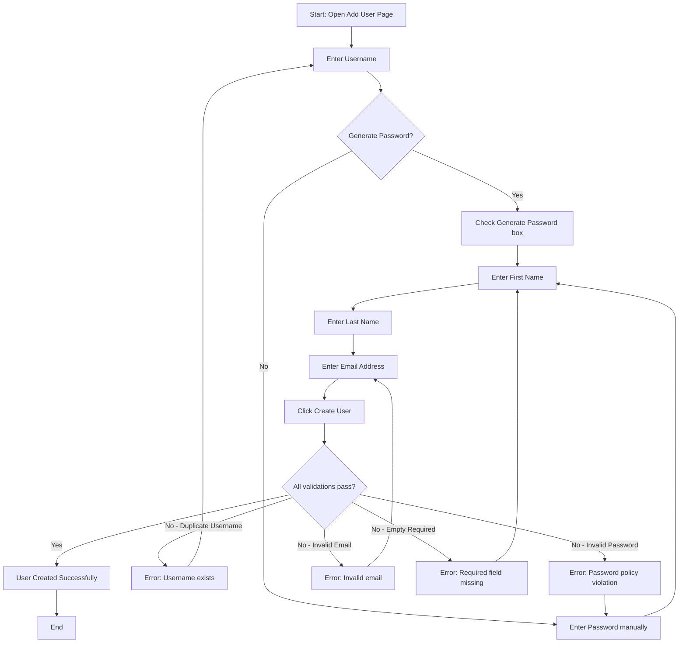
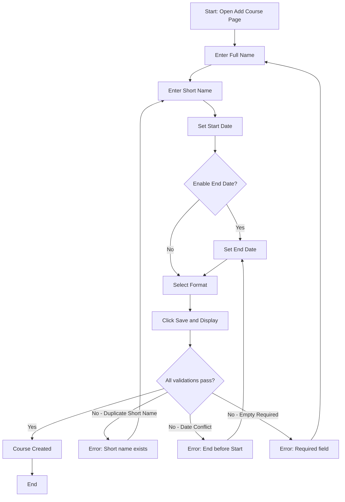
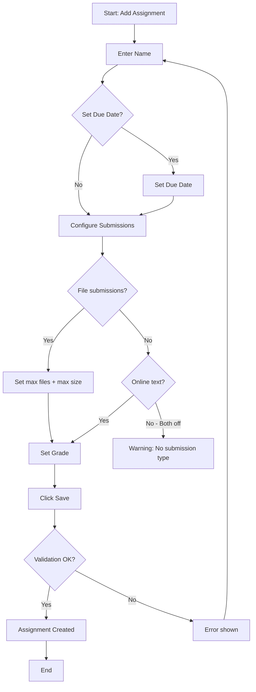
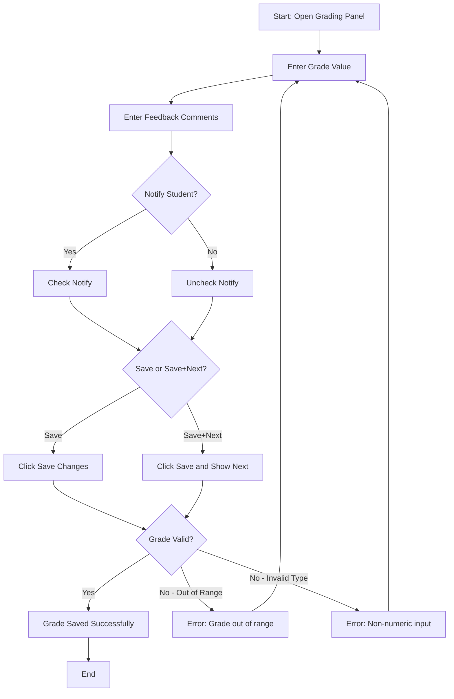
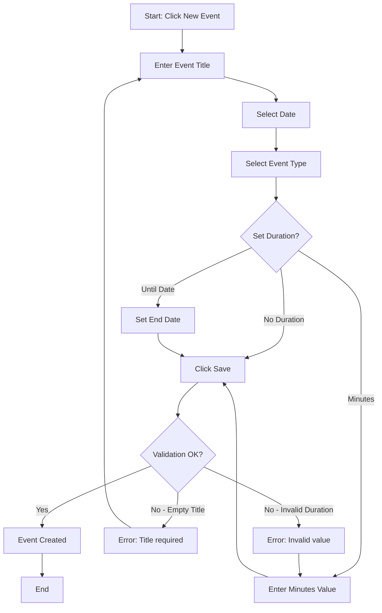
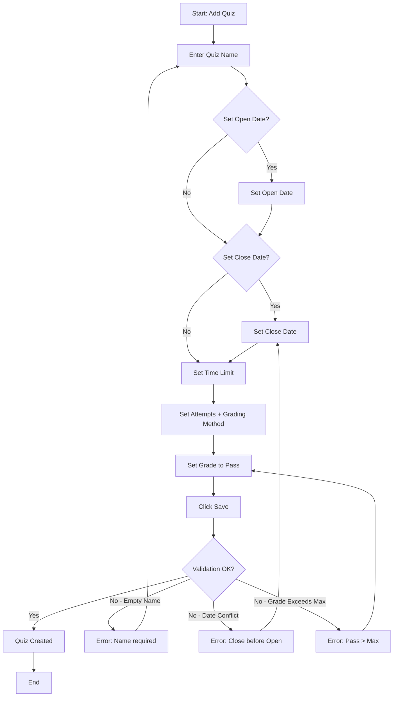

# Software Testing – Project 2: Black-box Testing Report

**Course:** Software Testing  
**Semester:** 2 - Year 2025-2026  
**Group name:** *(To be filled)*  
**Class:** *(To be filled)*  
**Product:** Mount Orange University — `https://school.moodledemo.net/`

---

## Group Members & Task Assignments

| No. | Family Name | First Name | Student ID | Role | Contribution (%) | Tasks |
|-----|-------------|------------|------------|------|------------------|-------|
| 1   |             |            |            |      |                  | Feature 001, 002 |
| 2   |             |            |            |      |                  | Feature 003, 004 |
| 3   |             |            |            |      |                  | Feature 005 |
| 4   |             |            |            |      |                  | Feature 006 |

---

## AI Tools Disclosure

This project used **Antigravity (Google Gemini-based AI agent)** to assist with:
- Exploring the Mount Orange website via automated browser agents.
- Drafting initial test case structures and report formatting.
- All generated content was reviewed, verified, and hand-edited by team members.

---

# Feature 001: Admin Adds a New User

## 1.1 Feature Description

The Site Administration module allows managers to manually create new user accounts in the Moodle system. The form includes multiple input fields with validation rules.

**Execution Flow:**
1. Log in as `manager` (credentials from login page).
2. Navigate to **Site administration > Users > Add a new user**.
3. Fill in the required and optional fields.
4. Click **Create user**.

## 1.2 Form Fields Catalog (from browser exploration)

| Field | Type | Required | Constraints / Rules |
|-------|------|----------|---------------------|
| Username | Text input | Yes | Lowercase letters, digits, hyphens, underscores, periods, @. No spaces. Must be unique. |
| Authentication method | Dropdown | Yes | Default: "Manual accounts". Options: Manual, Email-based self-registration, etc. |
| Suspended account | Checkbox | No | Default: unchecked |
| Generate password and notify user | Checkbox | No | If checked, password field becomes optional |
| Password | Text input | Conditional | Subject to site policies (e.g., Min 8 chars, ≥1 digit, ≥1 lowercase, ≥1 uppercase, ≥1 non-alphanumeric char) |
| Force password change | Checkbox | No | Default: unchecked |
| First name | Text input | Yes (❗) | Cannot be empty. Max 100 chars. |
| Last name | Text input | Yes (❗) | Cannot be empty. Max 100 chars. |
| Email address | Text input | Yes (❗) | Must be valid email format. Max 100 chars. Duplicates rejected unless allowed by site policy. |

## 1.3 Boundary Value Analysis (BVA)

**Explanation**: Testing 7 boundary values (`min-`, `min`, `min+`, `nom`, `max-`, `max`, `max+`) for each identified variable. To ensure isolation (Single Fault Assumption), when one variable is tested at a boundary, all other variables are explicitly held at their valid nominal (`nom`) values.

Applying Robust Single Fault BVA (6n + 1 test cases).

| TC ID | Technique | Variable Tested | Username | Password | First Name | Last Name | Email | Expected Result |
|-------|-----------|-----------------|----------|----------|------------|-----------|-------|-----------------|
| TC-001-001 | BVA | All (nom) | `usr001_uuuuuuuuuu` | `A1!apppppppp` | `ffffffffff` | `llllllllll` | `usr001_nom@test.com` | ✅ Accepted |
| TC-001-002 | BVA | V1: Username (min-) | `*(empty)*` | `A1!apppppppp` | `ffffffffff` | `llllllllll` | `usr002_nom@test.com` | ❌ Error |
| TC-001-003 | BVA | V1: Username (min) | `usr003_u` | `A1!apppppppp` | `ffffffffff` | `llllllllll` | `usr003_nom@test.com` | ✅ Accepted |
| TC-001-004 | BVA | V1: Username (min+) | `usr004_uu` | `A1!apppppppp` | `ffffffffff` | `llllllllll` | `usr004_nom@test.com` | ✅ Accepted |
| TC-001-005 | BVA | V1: Username (max-) | `usr005_uuuuuuuuuuuuuuuuuuuuuuuuuuuuuuuuuuuuuuuuuuuuuuuuuuuuuuuuuuuuuuuuuuuuuuuuuuuuuuuuuuuuuuuuuuuuu` | `A1!apppppppp` | `ffffffffff` | `llllllllll` | `usr005_nom@test.com` | ✅ Accepted |
| TC-001-006 | BVA | V1: Username (max) | `usr006_uuuuuuuuuuuuuuuuuuuuuuuuuuuuuuuuuuuuuuuuuuuuuuuuuuuuuuuuuuuuuuuuuuuuuuuuuuuuuuuuuuuuuuuuuuuuu` | `A1!apppppppp` | `ffffffffff` | `llllllllll` | `usr006_nom@test.com` | ✅ Accepted |
| TC-001-007 | BVA | V1: Username (max+) | `usr007_uuuuuuuuuuuuuuuuuuuuuuuuuuuuuuuuuuuuuuuuuuuuuuuuuuuuuuuuuuuuuuuuuuuuuuuuuuuuuuuuuuuuuuuuuuuuu` | `A1!apppppppp` | `ffffffffff` | `llllllllll` | `usr007_nom@test.com` | ❌ Error |
| TC-001-008 | BVA | V2: Password (min-) | `usr008_uuuuuuuuuu` | `ppppppp` | `ffffffffff` | `llllllllll` | `usr008_nom@test.com` | ❌ Error |
| TC-001-009 | BVA | V2: Password (min) | `usr009_uuuuuuuuuu` | `A1!apppp` | `ffffffffff` | `llllllllll` | `usr009_nom@test.com` | ✅ Accepted |
| TC-001-010 | BVA | V2: Password (min+) | `usr010_uuuuuuuuuu` | `A1!appppp` | `ffffffffff` | `llllllllll` | `usr010_nom@test.com` | ✅ Accepted |
| TC-001-011 | BVA | V2: Password (max-) | `usr011_uuuuuuuuuu` | `A1!appppppppppppppppppppppppppppppppppppppppppppppppppppppppppppppppppppppppppppppppppppppppppppppppppppppppppppppppppppppppppp` | `ffffffffff` | `llllllllll` | `usr011_nom@test.com` | ✅ Accepted |
| TC-001-012 | BVA | V2: Password (max) | `usr012_uuuuuuuuuu` | `A1!apppppppppppppppppppppppppppppppppppppppppppppppppppppppppppppppppppppppppppppppppppppppppppppppppppppppppppppppppppppppppppp` | `ffffffffff` | `llllllllll` | `usr012_nom@test.com` | ✅ Accepted |
| TC-001-013 | BVA | V2: Password (max+) | `usr013_uuuuuuuuuu` | `A1!appppppppppppppppppppppppppppppppppppppppppppppppppppppppppppppppppppppppppppppppppppppppppppppppppppppppppppppppppppppppppppp` | `ffffffffff` | `llllllllll` | `usr013_nom@test.com` | ❌ Error |
| TC-001-014 | BVA | V3: First Name (min-) | `usr014_uuuuuuuuuu` | `A1!apppppppp` | `*(empty)*` | `llllllllll` | `usr014_nom@test.com` | ❌ Error |
| TC-001-015 | BVA | V3: First Name (min) | `usr015_uuuuuuuuuu` | `A1!apppppppp` | `f` | `llllllllll` | `usr015_nom@test.com` | ✅ Accepted |
| TC-001-016 | BVA | V3: First Name (min+) | `usr016_uuuuuuuuuu` | `A1!apppppppp` | `ff` | `llllllllll` | `usr016_nom@test.com` | ✅ Accepted |
| TC-001-017 | BVA | V3: First Name (max-) | `usr017_uuuuuuuuuu` | `A1!apppppppp` | `fffffffffffffffffffffffffffffffffffffffffffffffffffffffffffffffffffffffffffffffffffffffffffffffffff` | `llllllllll` | `usr017_nom@test.com` | ✅ Accepted |
| TC-001-018 | BVA | V3: First Name (max) | `usr018_uuuuuuuuuu` | `A1!apppppppp` | `ffffffffffffffffffffffffffffffffffffffffffffffffffffffffffffffffffffffffffffffffffffffffffffffffffff` | `llllllllll` | `usr018_nom@test.com` | ✅ Accepted |
| TC-001-019 | BVA | V3: First Name (max+) | `usr019_uuuuuuuuuu` | `A1!apppppppp` | `fffffffffffffffffffffffffffffffffffffffffffffffffffffffffffffffffffffffffffffffffffffffffffffffffffff` | `llllllllll` | `usr019_nom@test.com` | ❌ Error |
| TC-001-020 | BVA | V4: Last Name (min-) | `usr020_uuuuuuuuuu` | `A1!apppppppp` | `ffffffffff` | `*(empty)*` | `usr020_nom@test.com` | ❌ Error |
| TC-001-021 | BVA | V4: Last Name (min) | `usr021_uuuuuuuuuu` | `A1!apppppppp` | `ffffffffff` | `l` | `usr021_nom@test.com` | ✅ Accepted |
| TC-001-022 | BVA | V4: Last Name (min+) | `usr022_uuuuuuuuuu` | `A1!apppppppp` | `ffffffffff` | `ll` | `usr022_nom@test.com` | ✅ Accepted |
| TC-001-023 | BVA | V4: Last Name (max-) | `usr023_uuuuuuuuuu` | `A1!apppppppp` | `ffffffffff` | `lllllllllllllllllllllllllllllllllllllllllllllllllllllllllllllllllllllllllllllllllllllllllllllllllll` | `usr023_nom@test.com` | ✅ Accepted |
| TC-001-024 | BVA | V4: Last Name (max) | `usr024_uuuuuuuuuu` | `A1!apppppppp` | `ffffffffff` | `llllllllllllllllllllllllllllllllllllllllllllllllllllllllllllllllllllllllllllllllllllllllllllllllllll` | `usr024_nom@test.com` | ✅ Accepted |
| TC-001-025 | BVA | V4: Last Name (max+) | `usr025_uuuuuuuuuu` | `A1!apppppppp` | `ffffffffff` | `lllllllllllllllllllllllllllllllllllllllllllllllllllllllllllllllllllllllllllllllllllllllllllllllllllll` | `usr025_nom@test.com` | ❌ Error |

## 1.4 Equivalence Class Partitioning (ECP)

**Explanation**: Identifying invalid equivalence classes for each variable. We select one representative invalid value from each class. To prevent fault masking, we apply the Single Fault Assumption by holding all other variables at their valid nominal values.

Applying Weak Robust ECP (Single Fault Assumption).

| TC ID | Technique | Class Tested | Username | Password | First Name | Last Name | Email | Expected Result |
|-------|-----------|--------------|----------|----------|------------|-----------|-------|-----------------|
| TC-001-026 | ECP | Username (U5: Uppercase) | `usr026_UsrNom` | `A1!apppppppp` | `ffffffffff` | `llllllllll` | `usr026_nom@test.com` | ❌ Error |
| TC-001-027 | ECP | Username (U6: Space) | `usr027_usr nom` | `A1!apppppppp` | `ffffffffff` | `llllllllll` | `usr027_nom@test.com` | ❌ Error |
| TC-001-028 | ECP | Username (U7: Special) | `usr028_usr!nom` | `A1!apppppppp` | `ffffffffff` | `llllllllll` | `usr028_nom@test.com` | ❌ Error |
| TC-001-029 | ECP | Username (U9: Duplicate) | `admin` | `A1!apppppppp` | `ffffffffff` | `llllllllll` | `usr029_nom@test.com` | ❌ Error |
| TC-001-030 | ECP | Password (P2: No digit) | `usr030_usr` | `Abcdefg!@` | `ffffffffff` | `llllllllll` | `usr030_nom@test.com` | ❌ Error |
| TC-001-031 | ECP | Password (P3: No uppercase) | `usr031_usr` | `abcdefg1!@` | `ffffffffff` | `llllllllll` | `usr031_nom@test.com` | ❌ Error |
| TC-001-032 | ECP | Password (P4: No lowercase) | `usr032_usr` | `ABCDEFG1!@` | `ffffffffff` | `llllllllll` | `usr032_nom@test.com` | ❌ Error |
| TC-001-033 | ECP | Password (P5: No special) | `usr033_usr` | `Abcdefg123` | `ffffffffff` | `llllllllll` | `usr033_nom@test.com` | ❌ Error |
| TC-001-034 | ECP | Email (E4: No @) | `usr034_usr` | `A1!apppppppp` | `ffffffffff` | `llllllllll` | `testexample.com` | ❌ Error |
| TC-001-035 | ECP | Email (E5: No domain) | `usr035_usr` | `A1!apppppppp` | `ffffffffff` | `llllllllll` | `test@` | ❌ Error |
| TC-001-036 | ECP | Email (E7: Space) | `usr036_usr` | `A1!apppppppp` | `ffffffffff` | `llllllllll` | `te st@ex.com` | ❌ Error |

## 1.5 Use-Case Testing

Following the lecture theory (Chapter on Use-case testing): Define actors, preconditions, basic flow, alternative flows, exception flows. Derive **test scenarios** as complete paths through the activity diagram.

**Use Case Name:** Add a New User  
**Actor:** Site Administrator (Manager)  
**Precondition:** Admin is logged in and on the "Add a new user" page.  
**Postcondition:** A new user account exists in the system.

**Basic Flow (BF):**
1. Admin enters a unique, valid username.
2. Admin enters a password meeting all complexity rules.
3. Admin enters a valid first name.
4. Admin enters a valid last name.
5. Admin enters a valid, unique email address.
6. Admin clicks "Create user".
7. System validates all fields — all pass.
8. System creates the user and redirects to user list.

**Alternative Flows:**
- **AF1 (Generate Password):** At step 2, Admin checks "Generate password and notify user" instead of entering a password manually. Flow continues from step 3.
- **AF2 (Suspend Account):** At step 1, Admin also checks "Suspended account". User is created but cannot log in.

**Exception Flows:**
- **EF1 (Duplicate Username):** At step 7, system finds the username already exists. Error displayed. Flow returns to step 1.
- **EF2 (Invalid Password):** At step 7, system finds password does not meet complexity rules. Error displayed. Flow returns to step 2.
- **EF3 (Invalid Email):** At step 7, system finds email is invalid or duplicate. Error displayed. Flow returns to step 5.
- **EF4 (Empty Required Field):** At step 7, system finds a required field (first name, last name) is empty. Error displayed.

**Activity Diagram:**

**Test Scenarios (paths through the activity diagram):**

| Scenario ID | Path | Description |
|-------------|------|-------------|
| S1 | A→B→C(No)→E→F→G→H→I→J(Yes)→K→P | Happy path: manual password, all valid |
| S2 | A→B→C(Yes)→D→F→G→H→I→J(Yes)→K→P | Generate password, all valid |
| S3 | A→B→C(No)→E→F→G→H→I→J(No)→L→B→... | Duplicate username error, re-enter |
| S4 | A→B→C(No)→E→F→G→H→I→J(No)→M→E→... | Invalid password error, re-enter |
| S5 | A→B→C(No)→E→F→G→H→I→J(No)→N→H→... | Invalid email error, re-enter |
| S6 | A→B→C(No)→E→F→G→H→I→J(No)→O→F→... | Empty first name/surname error |

## 1.6 Decision Table (Bonus)

**Explanation**: Decision Tables are used to model complex business logic where different combinations of conditions (inputs) yield specific actions (outputs). We map out the rules to ensure complete coverage of the logic constraints before deriving test cases.

Conditions: Password policy components. Testing combinations that should pass vs. fail.

| Rule | R1 | R2 | R3 | R4 | R5 | R6 |
|------|----|----|----|----|----|----|
| **C1:** Length ≥ 8 | T | T | T | T | T | F |
| **C2:** Has digit | T | T | T | T | F | - |
| **C3:** Has uppercase | T | T | T | F | - | - |
| **C4:** Has lowercase | T | T | F | - | - | - |
| **C5:** Has special char | T | F | - | - | - | - |
| **Action: Accept** | ✅ | | | | | |
| **Action: Reject** | | ❌ | ❌ | ❌ | ❌ | ❌ |

> **Note:** According to decision table theory (Chapter 7), the rules here are algebraically simplified using "Don't Care" (`-`) entries. Rule 6 represents 16 impossible/rejected rules, Rule 5 represents 8 rules, etc., ensuring all 32 combinations of the 5 binary conditions are covered completely without redundancy.

## 1.7 Test Cases Summary (Feature 001)

The full details of BVA and ECP test cases are listed in their respective sections above to maintain readability. The table below covers the Use-Case and Decision Table test cases.

| TC ID | Technique | Test Case Name | Username | Password | First Name | Last Name | Email | Expected Result |
|-------|-----------|----------------|----------|----------|------------|-----------|-------|-----------------|
| TC-001-037 | UC | Happy path (S1) | `usr037_usr` | `A1!apppppppp` | `ffffffffff` | `llllllllll` | `usr037_nom@test.com` | ✅ Accepted |
| TC-001-038 | UC | Generate password (S2) | `usr038_usr` | `*(empty)*` | `ffffffffff` | `llllllllll` | `usr038_nom@test.com` | ✅ Accepted |
| TC-001-039 | UC | Duplicate username (S3) | `admin` | `A1!apppppppp` | `ffffffffff` | `llllllllll` | `usr039_nom@test.com` | ❌ Error |
| TC-001-040 | UC | Invalid password (S4) | `usr040_usr` | `invalid` | `ffffffffff` | `llllllllll` | `usr040_nom@test.com` | ❌ Error |
| TC-001-041 | UC | Invalid email (S5) | `usr041_usr` | `A1!apppppppp` | `ffffffffff` | `llllllllll` | `invalid` | ❌ Error |
| TC-001-042 | UC | Empty required (S6) | `usr042_usr` | `A1!apppppppp` | `*(empty)*` | `llllllllll` | `usr042_nom@test.com` | ❌ Error |
| TC-001-043 | DT | All rules met (R1) | `usr043_usr` | `Abcde1!@` | `ffffffffff` | `llllllllll` | `usr043_nom@test.com` | ✅ Accepted |
| TC-001-044 | DT | Missing special char (R2) | `usr044_usr` | `Abcdefg1` | `ffffffffff` | `llllllllll` | `usr044_nom@test.com` | ❌ Error |
| TC-001-045 | DT | Missing lowercase (R3) | `usr045_usr` | `ABCDEFG1!` | `ffffffffff` | `llllllllll` | `usr045_nom@test.com` | ❌ Error |
| TC-001-046 | DT | Missing uppercase (R4) | `usr046_usr` | `abcdefg1!` | `ffffffffff` | `llllllllll` | `usr046_nom@test.com` | ❌ Error |
| TC-001-047 | DT | Missing digit (R5) | `usr047_usr` | `Abcdefgh!` | `ffffffffff` | `llllllllll` | `usr047_nom@test.com` | ❌ Error |
| TC-001-048 | DT | Length < 8 (R6) | `usr048_usr` | `Abc1!` | `ffffffffff` | `llllllllll` | `usr048_nom@test.com` | ❌ Error |

---

# Feature 002: Admin Creates a New Course

## 2.1 Feature Description

Managers can create new course spaces with configurable settings. The form enforces chronological constraints on dates and uniqueness of short names.

**Execution Flow:**
1. Log in as `manager`.
2. Go to **Site administration > Courses > Add a new course**.
3. Fill in Course full name, Short name, dates, format, etc.
4. Click **Save and display**.

## 2.2 Form Fields Catalog

| Field | Type | Required | Constraints |
|-------|------|----------|-------------|
| Course full name | Text input | Yes (❗) | Cannot be empty |
| Course short name | Text input | Yes (❗) | Must be unique across all courses. Max 255 chars. |
| Course category | Dropdown | Yes | Must select a valid category |
| Course visibility | Dropdown | No | Show / Hide |
| Course start date | Date picker (day/month/year/hour/minute) | Yes | Valid date |
| Course end date | Date picker | No | Must be AFTER start date if "Enable" is checked |
| Enable end date | Checkbox | No | Toggles end date validation |
| Course ID number | Text input | No | Optional identifier |
| Course summary | Rich text editor | No | Free text |
| Course image | File upload | No | Image files only (GIF, JPG, PNG) |
| Course format | Dropdown | Yes | Weekly, Topics, Social, Single activity |
| Number of sections | Number input | Yes | Default 10. Range depends on format. |

## 2.3 Boundary Value Analysis (BVA)

**Explanation**: Testing 7 boundary values (`min-`, `min`, `min+`, `nom`, `max-`, `max`, `max+`) for each identified variable. To ensure isolation (Single Fault Assumption), when one variable is tested at a boundary, all other variables are explicitly held at their valid nominal (`nom`) values.

Applying Robust Single Fault BVA (6n + 1 test cases).

| TC ID | Technique | Variable Tested | Full Name | Short Name | End Date | Sections | Expected Result |
|-------|-----------|-----------------|-----------|------------|----------|----------|-----------------|
| TC-002-001 | BVA | All (nom) | `fn001_nnnnnnnnnnnnnnnnnnnn` | `sn001_ssssssss` | `Start + 30 days` | `10` | ✅ Accepted |
| TC-002-002 | BVA | V1: Full Name Length (min-) | `*(empty)*` | `sn002_ssssssss` | `Start + 30 days` | `10` | ❌ Error |
| TC-002-003 | BVA | V1: Full Name Length (min) | `fn003_n` | `sn003_ssssssss` | `Start + 30 days` | `10` | ✅ Accepted |
| TC-002-004 | BVA | V1: Full Name Length (min+) | `fn004_nn` | `sn004_ssssssss` | `Start + 30 days` | `10` | ✅ Accepted |
| TC-002-005 | BVA | V1: Full Name Length (max-) | `fn005_nnnnnnnnnnnnnnnnnnnnnnnnnnnnnnnnnnnnnnnnnnnnnnnnnnnnnnnnnnnnnnnnnnnnnnnnnnnnnnnnnnnnnnnnnnnnnnnnnnnnnnnnnnnnnnnnnnnnnnnnnnnnnnnnnnnnnnnnnnnnnnnnnnnnnnnnnnnnnnnnnnnnnnnnnnnnnnnnnnnnnnnnnnnnnnnnnnnnnnnnnnnnnnnnnnnnnnnnnnnnnnnnnnnnnnnnnnnnnnnnnnnnnnnn` | `sn005_ssssssss` | `Start + 30 days` | `10` | ✅ Accepted |
| TC-002-006 | BVA | V1: Full Name Length (max) | `fn006_nnnnnnnnnnnnnnnnnnnnnnnnnnnnnnnnnnnnnnnnnnnnnnnnnnnnnnnnnnnnnnnnnnnnnnnnnnnnnnnnnnnnnnnnnnnnnnnnnnnnnnnnnnnnnnnnnnnnnnnnnnnnnnnnnnnnnnnnnnnnnnnnnnnnnnnnnnnnnnnnnnnnnnnnnnnnnnnnnnnnnnnnnnnnnnnnnnnnnnnnnnnnnnnnnnnnnnnnnnnnnnnnnnnnnnnnnnnnnnnnnnnnnnnn` | `sn006_ssssssss` | `Start + 30 days` | `10` | ✅ Accepted |
| TC-002-007 | BVA | V1: Full Name Length (max+) | `fn007_nnnnnnnnnnnnnnnnnnnnnnnnnnnnnnnnnnnnnnnnnnnnnnnnnnnnnnnnnnnnnnnnnnnnnnnnnnnnnnnnnnnnnnnnnnnnnnnnnnnnnnnnnnnnnnnnnnnnnnnnnnnnnnnnnnnnnnnnnnnnnnnnnnnnnnnnnnnnnnnnnnnnnnnnnnnnnnnnnnnnnnnnnnnnnnnnnnnnnnnnnnnnnnnnnnnnnnnnnnnnnnnnnnnnnnnnnnnnnnnnnnnnnnnn` | `sn007_ssssssss` | `Start + 30 days` | `10` | ❌ Error |
| TC-002-008 | BVA | V2: Short Name Length (min-) | `fn008_nnnnnnnnnnnnnnnnnnnn` | `*(empty)*` | `Start + 30 days` | `10` | ❌ Error |
| TC-002-009 | BVA | V2: Short Name Length (min) | `fn009_nnnnnnnnnnnnnnnnnnnn` | `sn009_s` | `Start + 30 days` | `10` | ✅ Accepted |
| TC-002-010 | BVA | V2: Short Name Length (min+) | `fn010_nnnnnnnnnnnnnnnnnnnn` | `sn010_ss` | `Start + 30 days` | `10` | ✅ Accepted |
| TC-002-011 | BVA | V2: Short Name Length (max-) | `fn011_nnnnnnnnnnnnnnnnnnnn` | `sn011_ssssssssssssssssssssssssssssssssssssssssssssssssssssssssssssssssssssssssssssssssssssssssssssssssssssssssssssssssssssssssssssssssssssssssssssssssssssssssssssssssssssssssssssssssssssssssssssssssssssssssssssssssssssssssssssssssssssssssssssssssssssssss` | `Start + 30 days` | `10` | ✅ Accepted |
| TC-002-012 | BVA | V2: Short Name Length (max) | `fn012_nnnnnnnnnnnnnnnnnnnn` | `sn012_ssssssssssssssssssssssssssssssssssssssssssssssssssssssssssssssssssssssssssssssssssssssssssssssssssssssssssssssssssssssssssssssssssssssssssssssssssssssssssssssssssssssssssssssssssssssssssssssssssssssssssssssssssssssssssssssssssssssssssssssssssssssss` | `Start + 30 days` | `10` | ✅ Accepted |
| TC-002-013 | BVA | V2: Short Name Length (max+) | `fn013_nnnnnnnnnnnnnnnnnnnn` | `sn013_ssssssssssssssssssssssssssssssssssssssssssssssssssssssssssssssssssssssssssssssssssssssssssssssssssssssssssssssssssssssssssssssssssssssssssssssssssssssssssssssssssssssssssssssssssssssssssssssssssssssssssssssssssssssssssssssssssssssssssssssssssssssss` | `Start + 30 days` | `10` | ❌ Error |
| TC-002-014 | BVA | V3: End Date Chronology (min-) | `fn014_nnnnnnnnnnnnnnnnnnnn` | `sn014_ssssssss` | `Start - 1 day` | `10` | ❌ Error |
| TC-002-015 | BVA | V3: End Date Chronology (min) | `fn015_nnnnnnnnnnnnnnnnnnnn` | `sn015_ssssssss` | `Start Date` | `10` | ❌ Error |
| TC-002-016 | BVA | V3: End Date Chronology (min+) | `fn016_nnnnnnnnnnnnnnnnnnnn` | `sn016_ssssssss` | `Start + 1 day` | `10` | ✅ Accepted |
| TC-002-017 | BVA | V3: End Date Chronology (max-) | `fn017_nnnnnnnnnnnnnnnnnnnn` | `sn017_ssssssss` | `Start + 10 yrs` | `10` | ✅ Accepted |
| TC-002-018 | BVA | V3: End Date Chronology (max) | `fn018_nnnnnnnnnnnnnnnnnnnn` | `sn018_ssssssss` | `Start + 11 yrs` | `10` | ✅ Accepted |
| TC-002-019 | BVA | V3: End Date Chronology (max+) | `fn019_nnnnnnnnnnnnnnnnnnnn` | `sn019_ssssssss` | `Start + 12 yrs` | `10` | ✅ Accepted |
| TC-002-020 | BVA | V4: Number of Sections (min-) | `fn020_nnnnnnnnnnnnnnnnnnnn` | `sn020_ssssssss` | `Start + 30 days` | `-1` | ❌ Error |
| TC-002-021 | BVA | V4: Number of Sections (min) | `fn021_nnnnnnnnnnnnnnnnnnnn` | `sn021_ssssssss` | `Start + 30 days` | `0` | ✅ Accepted |
| TC-002-022 | BVA | V4: Number of Sections (min+) | `fn022_nnnnnnnnnnnnnnnnnnnn` | `sn022_ssssssss` | `Start + 30 days` | `1` | ✅ Accepted |
| TC-002-023 | BVA | V4: Number of Sections (max-) | `fn023_nnnnnnnnnnnnnnnnnnnn` | `sn023_ssssssss` | `Start + 30 days` | `51` | ✅ Accepted |
| TC-002-024 | BVA | V4: Number of Sections (max) | `fn024_nnnnnnnnnnnnnnnnnnnn` | `sn024_ssssssss` | `Start + 30 days` | `52` | ✅ Accepted |
| TC-002-025 | BVA | V4: Number of Sections (max+) | `fn025_nnnnnnnnnnnnnnnnnnnn` | `sn025_ssssssss` | `Start + 30 days` | `53` | ❌ Error |

## 2.4 Equivalence Class Partitioning (ECP)

**Explanation**: Identifying invalid equivalence classes for each variable. We select one representative invalid value from each class. To prevent fault masking, we apply the Single Fault Assumption by holding all other variables at their valid nominal values.

Applying Weak Robust ECP (Single Fault Assumption).

| TC ID | Technique | Class Tested | Full Name | Short Name | End Date | Sections | Expected Result |
|-------|-----------|--------------|-----------|------------|----------|----------|-----------------|
| TC-002-026 | ECP | Short Name (SN2: Duplicate) | `fn026_nnnnnnnnnnnnnnnnnnnn` | `TC001` | `Start + 30 days` | `10` | ❌ Error |

## 2.5 Use-Case Testing

**Use Case Name:** Create a New Course  
**Actor:** Site Administrator  
**Precondition:** Admin is on "Add a new course" page.  
**Postcondition:** Course is created and visible.

**Basic Flow (BF):**
1. Admin enters a unique course full name.
2. Admin enters a unique course short name.
3. Admin sets course start date.
4. Admin enables and sets course end date (after start date).
5. Admin selects course format.
6. Admin clicks "Save and display".
7. System validates → Course created.

**Alternative Flows:**
- **AF1:** Admin disables end date (unchecks "Enable"). No end date validation.
- **AF2:** Admin sets visibility to "Hide". Course created but hidden from students.

**Exception Flows:**
- **EF1:** Duplicate short name → Error message.
- **EF2:** End date before start date → Error message.
- **EF3:** Empty full name or short name → Error message.

**Activity Diagram:**

**Test Scenarios:**

| Scenario | Path | Description |
|----------|------|-------------|
| S1 | BF complete | All valid, end date enabled and after start |
| S2 | AF1 | End date disabled, all other valid |
| S3 | AF2 | Visibility set to Hide |
| S4 | EF1 | Duplicate short name |
| S5 | EF2 | End date before start date |
| S6 | EF3 | Empty full name |

## 2.6 Decision Table (Bonus)

**Explanation**: Decision Tables are used to model complex business logic where different combinations of conditions (inputs) yield specific actions (outputs). We map out the rules to ensure complete coverage of the logic constraints before deriving test cases.

Conditions: Course format and End date configuration checkboxes. According to the documentation, "Calculate the end date from the number of sections" is available **for courses in weekly format only**.

| Rule | R1 | R2 | R3 | R4 | R5 |
|------|----|----|----|----|----|
| **C1:** Course format = Weekly | F | F | T | T | T |
| **C2:** End date Enable checked | F | T | F | T | T |
| **C3:** Calculate end date from sections checked | - | - | - | F | T |
| **A1:** End date pickers enabled (editable) | | ✅ | | ✅ | |
| **A2:** End date pickers disabled (auto‑calculated) | | | | | ✅ |
| **A3:** End date pickers disabled (unchecked/hidden) | ✅ | | ✅ | | |

> Note: Rules are logically reduced using "Don't Care" (`-`) notation (Chapter 7). For instance, if the course format is not "Weekly" (C1=F) or if the end date is disabled entirely (C2=F), the value of C3 has no impact on the outcome.

## 2.7 Test Cases Summary (Feature 002)

The full details of BVA and ECP test cases are listed in their respective sections above to maintain readability. The table below covers the Use-Case and Decision Table test cases.

| TC ID | Technique | Test Case Name | Full Name | Short Name | End Date | Sections | Expected Result |
|-------|-----------|----------------|-----------|------------|----------|----------|-----------------|
| TC-002-027 | DT | Non-Weekly + End Date OFF (R1) | `fn027_nnnnnnnnnnnnnnnnnnnn` | `sn027_ssssssss` | `Disabled` | `10` | ✅ Accepted |
| TC-002-028 | DT | Non-Weekly + End Date ON (R2) | `fn028_nnnnnnnnnnnnnnnnnnnn` | `sn028_ssssssss` | `Start + 30 days` | `10` | ✅ Accepted |
| TC-002-029 | DT | Weekly + End Date OFF (R3) | `fn029_nnnnnnnnnnnnnnnnnnnn` | `sn029_ssssssss` | `Disabled` | `10` | ✅ Accepted |
| TC-002-030 | DT | Weekly + End Date ON + No Calc (R4) | `fn030_nnnnnnnnnnnnnnnnnnnn` | `sn030_ssssssss` | `Start + 30 days` | `10` | ✅ Accepted |
| TC-002-031 | DT | Weekly + End Date ON + Auto-calc (R5) | `fn031_nnnnnnnnnnnnnnnnnnnn` | `sn031_ssssssss` | `Start + 30 days` | `10` | ✅ Accepted |
| TC-002-032 | UC | Happy path S1 | `fn032_nnnnnnnnnnnnnnnnnnnn` | `sn032_ssssssss` | `Start + 30 days` | `10` | ✅ Accepted |
| TC-002-033 | UC | End date disabled S2 | `fn033_nnnnnnnnnnnnnnnnnnnn` | `sn033_ssssssss` | `Disabled` | `10` | ✅ Accepted |
| TC-002-034 | UC | Duplicate short name S4 | `fn034_nnnnnnnnnnnnnnnnnnnn` | `TC001` | `Start + 30 days` | `10` | ❌ Error |
| TC-002-035 | UC | Date conflict S5 | `fn035_nnnnnnnnnnnnnnnnnnnn` | `sn035_ssssssss` | `Start - 1 day` | `10` | ❌ Error |

---

# Feature 003: Teacher Creates Assignment

## 3.1 Feature Description

Teachers create assignment activities within courses, configuring submission types, deadlines, file limits, and grading settings.

**Execution Flow:**
1. Log in as `teacher`.
2. Navigate to a course, toggle **Edit mode** on.
3. Click **Add an activity or resource > Assignment**.
4. Configure settings. Click **Save and return to course**.

## 3.2 Form Fields Catalog

| Field | Type | Required | Constraints |
|-------|------|----------|-------------|
| Assignment name | Text input | Yes (❗) | Cannot be empty |
| Description | Rich text editor | No | Free text |
| Allow submissions from | Date picker + Enable checkbox | No | Valid date |
| Due date | Date picker + Enable checkbox | No | Must be after "Allow submissions from" |
| Cut-off date | Date picker + Enable checkbox | No | Must be after Due date |
| Remind me to grade by | Date picker + Enable checkbox | No | Valid date |
| File submissions | Checkbox | No | Enable/disable file submission |
| Online text | Checkbox | No | Enable/disable online text |
| Maximum number of uploaded files | Dropdown | Conditional | 1–20 (only if File submissions enabled) |
| Maximum submission size | Dropdown | Conditional | Various sizes up to site limit (e.g., 256MB) |
| Accepted file types | Text / selector | No | e.g., .pdf, .docx |
| Word limit | Number input | Conditional | Only if Online text enabled |
| Maximum grade | Dropdown/input | Yes | Default 100. Options: Point, Scale |
| Grade to pass | Number input | No | Must be ≤ Maximum grade |
| Grading method | Dropdown | No | Simple direct grading, Rubric, Marking guide |

## 3.3 Boundary Value Analysis (BVA)

**Explanation**: Testing 7 boundary values (`min-`, `min`, `min+`, `nom`, `max-`, `max`, `max+`) for each identified variable. To ensure isolation (Single Fault Assumption), when one variable is tested at a boundary, all other variables are explicitly held at their valid nominal (`nom`) values.

Applying Robust Single Fault BVA (6n + 1 test cases).

| TC ID | Technique | Variable Tested | Assig. Name | Grade to Pass | Due Date | Cut-off Date | Expected Result |
|-------|-----------|-----------------|-------------|---------------|----------|--------------|-----------------|
| TC-003-001 | BVA | All (nom) | `an001_aaaaaaaaaaaaaaaaaaaaaaaaaaaaaa` | `50` | `Allow + 7 days` | `Due + 7 days` | ✅ Accepted |
| TC-003-002 | BVA | V1: Name Length (min-) | `*(empty)*` | `50` | `Allow + 7 days` | `Due + 7 days` | ❌ Error |
| TC-003-003 | BVA | V1: Name Length (min) | `an003_a` | `50` | `Allow + 7 days` | `Due + 7 days` | ✅ Accepted |
| TC-003-004 | BVA | V1: Name Length (min+) | `an004_aa` | `50` | `Allow + 7 days` | `Due + 7 days` | ✅ Accepted |
| TC-003-005 | BVA | V1: Name Length (max-) | `an005_aaaaaaaaaaaaaaaaaaaaaaaaaaaaaaaaaaaaaaaaaaaaaaaaaaaaaaaaaaaaaaaaaaaaaaaaaaaaaaaaaaaaaaaaaaaaaaaaaaaaaaaaaaaaaaaaaaaaaaaaaaaaaaaaaaaaaaaaaaaaaaaaaaaaaaaaaaaaaaaaaaaaaaaaaaaaaaaaaaaaaaaaaaaaaaaaaaaaaaaaaaaaaaaaaaaaaaaaaaaaaaaaaaaaaaaaaaaaaaaaaaaaaaaaaa` | `50` | `Allow + 7 days` | `Due + 7 days` | ✅ Accepted |
| TC-003-006 | BVA | V1: Name Length (max) | `an006_aaaaaaaaaaaaaaaaaaaaaaaaaaaaaaaaaaaaaaaaaaaaaaaaaaaaaaaaaaaaaaaaaaaaaaaaaaaaaaaaaaaaaaaaaaaaaaaaaaaaaaaaaaaaaaaaaaaaaaaaaaaaaaaaaaaaaaaaaaaaaaaaaaaaaaaaaaaaaaaaaaaaaaaaaaaaaaaaaaaaaaaaaaaaaaaaaaaaaaaaaaaaaaaaaaaaaaaaaaaaaaaaaaaaaaaaaaaaaaaaaaaaaaaaaaa` | `50` | `Allow + 7 days` | `Due + 7 days` | ✅ Accepted |
| TC-003-007 | BVA | V1: Name Length (max+) | `an007_aaaaaaaaaaaaaaaaaaaaaaaaaaaaaaaaaaaaaaaaaaaaaaaaaaaaaaaaaaaaaaaaaaaaaaaaaaaaaaaaaaaaaaaaaaaaaaaaaaaaaaaaaaaaaaaaaaaaaaaaaaaaaaaaaaaaaaaaaaaaaaaaaaaaaaaaaaaaaaaaaaaaaaaaaaaaaaaaaaaaaaaaaaaaaaaaaaaaaaaaaaaaaaaaaaaaaaaaaaaaaaaaaaaaaaaaaaaaaaaaaaaaaaaaaaaa` | `50` | `Allow + 7 days` | `Due + 7 days` | ❌ Error |
| TC-003-008 | BVA | V2: Grade to Pass (min-) | `an008_aaaaaaaaaaaaaaaaaaaaaaaaaaaaaa` | `-1` | `Allow + 7 days` | `Due + 7 days` | ❌ Error |
| TC-003-009 | BVA | V2: Grade to Pass (min) | `an009_aaaaaaaaaaaaaaaaaaaaaaaaaaaaaa` | `0` | `Allow + 7 days` | `Due + 7 days` | ✅ Accepted |
| TC-003-010 | BVA | V2: Grade to Pass (min+) | `an010_aaaaaaaaaaaaaaaaaaaaaaaaaaaaaa` | `1` | `Allow + 7 days` | `Due + 7 days` | ✅ Accepted |
| TC-003-011 | BVA | V2: Grade to Pass (max-) | `an011_aaaaaaaaaaaaaaaaaaaaaaaaaaaaaa` | `99` | `Allow + 7 days` | `Due + 7 days` | ✅ Accepted |
| TC-003-012 | BVA | V2: Grade to Pass (max) | `an012_aaaaaaaaaaaaaaaaaaaaaaaaaaaaaa` | `100` | `Allow + 7 days` | `Due + 7 days` | ✅ Accepted |
| TC-003-013 | BVA | V2: Grade to Pass (max+) | `an013_aaaaaaaaaaaaaaaaaaaaaaaaaaaaaa` | `101` | `Allow + 7 days` | `Due + 7 days` | ❌ Error |
| TC-003-014 | BVA | V3: Due vs Allow (min-) | `an014_aaaaaaaaaaaaaaaaaaaaaaaaaaaaaa` | `50` | `Allow - 1 day` | `Due + 7 days` | ❌ Error |
| TC-003-015 | BVA | V3: Due vs Allow (min) | `an015_aaaaaaaaaaaaaaaaaaaaaaaaaaaaaa` | `50` | `Allow Date` | `Due + 7 days` | ✅ Accepted |
| TC-003-016 | BVA | V3: Due vs Allow (min+) | `an016_aaaaaaaaaaaaaaaaaaaaaaaaaaaaaa` | `50` | `Allow + 1 day` | `Due + 7 days` | ✅ Accepted |
| TC-003-017 | BVA | V3: Due vs Allow (max-) | `an017_aaaaaaaaaaaaaaaaaaaaaaaaaaaaaa` | `50` | `Allow + 10 yrs` | `Due + 7 days` | ✅ Accepted |
| TC-003-018 | BVA | V3: Due vs Allow (max) | `an018_aaaaaaaaaaaaaaaaaaaaaaaaaaaaaa` | `50` | `Allow + 11 yrs` | `Due + 7 days` | ✅ Accepted |
| TC-003-019 | BVA | V3: Due vs Allow (max+) | `an019_aaaaaaaaaaaaaaaaaaaaaaaaaaaaaa` | `50` | `Allow + 12 yrs` | `Due + 7 days` | ✅ Accepted |
| TC-003-020 | BVA | V4: Cut-off vs Due (min-) | `an020_aaaaaaaaaaaaaaaaaaaaaaaaaaaaaa` | `50` | `Allow + 7 days` | `Due - 1 day` | ❌ Error |
| TC-003-021 | BVA | V4: Cut-off vs Due (min) | `an021_aaaaaaaaaaaaaaaaaaaaaaaaaaaaaa` | `50` | `Allow + 7 days` | `Due Date` | ✅ Accepted |
| TC-003-022 | BVA | V4: Cut-off vs Due (min+) | `an022_aaaaaaaaaaaaaaaaaaaaaaaaaaaaaa` | `50` | `Allow + 7 days` | `Due + 1 day` | ✅ Accepted |
| TC-003-023 | BVA | V4: Cut-off vs Due (max-) | `an023_aaaaaaaaaaaaaaaaaaaaaaaaaaaaaa` | `50` | `Allow + 7 days` | `Due + 10 yrs` | ✅ Accepted |
| TC-003-024 | BVA | V4: Cut-off vs Due (max) | `an024_aaaaaaaaaaaaaaaaaaaaaaaaaaaaaa` | `50` | `Allow + 7 days` | `Due + 11 yrs` | ✅ Accepted |
| TC-003-025 | BVA | V4: Cut-off vs Due (max+) | `an025_aaaaaaaaaaaaaaaaaaaaaaaaaaaaaa` | `50` | `Allow + 7 days` | `Due + 12 yrs` | ✅ Accepted |

## 3.4 Equivalence Class Partitioning (ECP)

**Explanation**: Identifying invalid equivalence classes for each variable. We select one representative invalid value from each class. To prevent fault masking, we apply the Single Fault Assumption by holding all other variables at their valid nominal values.

Applying Weak Robust ECP.

No independent invalid ECP classes separate from BVA limits for this feature. Grade-to-Pass and date constraints are fully covered by BVA boundaries above.

## 3.5 Use-Case Testing

**Use Case Name:** Create Assignment  
**Actor:** Teacher  
**Precondition:** Teacher is in a course with Edit mode on.

**Basic Flow:** Enter name → Set dates → Choose submission type → Set file limits → Set grade → Save.

**Alternative Flows:**
- AF1: Only online text submission (no file upload).
- AF2: No due date set (open-ended assignment).

**Exception Flows:**
- EF1: Empty assignment name.
- EF2: Cut-off date before due date.
- EF3: Grade to pass exceeds maximum grade.

**Test Scenarios:**

| Scenario | Description |
|----------|-------------|
| S1 | Happy path: file submission, due date, grade 100 |
| S2 | Online text only, no due date |
| S3 | Both submission types enabled |
| S4 | Empty name error |
| S5 | Cut-off before due date error |
| S6 | Grade to pass > Max grade error |

## 3.6 Decision Table (Bonus)

**Explanation**: Decision Tables are used to model complex business logic where different combinations of conditions (inputs) yield specific actions (outputs). We map out the rules to ensure complete coverage of the logic constraints before deriving test cases.

Conditions: Submission type checkboxes. These checkboxes control field visibility on the form — verifiable UI changes.

| Rule | R1 | R2 | R3 | R4 |
|------|----|----|----|-----|
| **C1:** File submissions checked | T | T | F | F |
| **C2:** Online text checked | T | F | T | F |
| **A1:** Max files dropdown visible | ✅ | ✅ | | |
| **A2:** Max submission size visible | ✅ | ✅ | | |
| **A3:** Accepted file types visible | ✅ | ✅ | | |
| **A4:** Word limit field visible | ✅ | | ✅ | |
| **A5:** No submission method available | | | | ⚠️ |

## 3.7 Test Cases Summary (Feature 003)

The full details of BVA and ECP test cases are listed in their respective sections above to maintain readability. The table below covers the Use-Case and Decision Table test cases.

| TC ID | Technique | Test Case Name | Assig. Name | Grade to Pass | Due Date | Cut-off Date | Expected Result |
|-------|-----------|----------------|-------------|---------------|----------|--------------|-----------------|
| TC-003-026 | DT | File + Online both on (R1) | `an026_aaaaaaaaaaaaaaaaaaaaaaaaaaaaaa` | `50` | `Allow + 7 days` | `Due + 7 days` | ✅ Accepted |
| TC-003-027 | DT | File only (R2) | `an027_aaaaaaaaaaaaaaaaaaaaaaaaaaaaaa` | `50` | `Allow + 7 days` | `Due + 7 days` | ✅ Accepted |
| TC-003-028 | DT | Online text only (R3) | `an028_aaaaaaaaaaaaaaaaaaaaaaaaaaaaaa` | `50` | `Allow + 7 days` | `Due + 7 days` | ✅ Accepted |
| TC-003-029 | DT | Both off (R4) | `an029_aaaaaaaaaaaaaaaaaaaaaaaaaaaaaa` | `50` | `Allow + 7 days` | `Due + 7 days` | ✅ Accepted |
| TC-003-030 | UC | Happy path | `an030_aaaaaaaaaaaaaaaaaaaaaaaaaaaaaa` | `50` | `Allow + 7 days` | `Due + 7 days` | ✅ Accepted |
| TC-003-031 | UC | No due date | `an031_aaaaaaaaaaaaaaaaaaaaaaaaaaaaaa` | `50` | `Disabled` | `Due + 7 days` | ✅ Accepted |
| TC-003-032 | UC | Empty name error | `*(empty)*` | `50` | `Allow + 7 days` | `Due + 7 days` | ❌ Error |
| TC-003-033 | UC | Date conflict | `an033_aaaaaaaaaaaaaaaaaaaaaaaaaaaaaa` | `50` | `Allow - 1 day` | `Due + 7 days` | ❌ Error |

---

# Feature 004: Teacher Grades an Assignment

## 4.1 Feature Description

The grading interface allows teachers to assign numerical scores and provide feedback on student submissions.

**Execution Flow:**
1. Log in as `teacher`.
2. Navigate to a course > Assignment.
3. Click **Grade** or access **View all submissions** > Grade icon.
4. Enter score in grade field, add feedback, click **Save changes**.

## 4.2 Form Fields Catalog (verified via browser)

| Field | Type | Required | Constraints |
|-------|------|----------|-------------|
| Grade out of 100 | Numeric input | No | Range: 0.00–100.00 (decimal allowed). Cannot exceed maximum grade. |
| Feedback comments | Rich text editor (TinyMCE) | No | Free text with formatting |
| Feedback files | File picker | No | Depends on assignment settings. Max 256MB |
| Notify student | Checkbox | No | Default: checked. Sends email notification. |

## 4.3 Boundary Value Analysis (BVA)

**Explanation**: Testing 7 boundary values (`min-`, `min`, `min+`, `nom`, `max-`, `max`, `max+`) for each identified variable. To ensure isolation (Single Fault Assumption), when one variable is tested at a boundary, all other variables are explicitly held at their valid nominal (`nom`) values.

Applying Robust Single Fault BVA (6n + 1 test cases).

| TC ID | Technique | Variable Tested | Grade Value | Feedback | Notify | Expected Result |
|-------|-----------|-----------------|-------------|----------|--------|-----------------|
| TC-004-001 | BVA | All (nom) | `50` | `Good work` | `Yes` | ✅ Accepted |
| TC-004-002 | BVA | V1: Grade Value (min-) | `-0.01` | `Good work` | `Yes` | ❌ Error |
| TC-004-003 | BVA | V1: Grade Value (min) | `0` | `Good work` | `Yes` | ✅ Accepted |
| TC-004-004 | BVA | V1: Grade Value (min+) | `0.01` | `Good work` | `Yes` | ✅ Accepted |
| TC-004-005 | BVA | V1: Grade Value (max-) | `99.99` | `Good work` | `Yes` | ✅ Accepted |
| TC-004-006 | BVA | V1: Grade Value (max) | `100` | `Good work` | `Yes` | ✅ Accepted |
| TC-004-007 | BVA | V1: Grade Value (max+) | `100.01` | `Good work` | `Yes` | ❌ Error |

## 4.4 Equivalence Class Partitioning (ECP)

**Explanation**: Identifying invalid equivalence classes for each variable. We select one representative invalid value from each class. To prevent fault masking, we apply the Single Fault Assumption by holding all other variables at their valid nominal values.

Applying Weak Robust ECP (Single Fault Assumption).

| TC ID | Technique | Class Tested | Grade Value | Feedback | Notify | Expected Result |
|-------|-----------|--------------|-------------|----------|--------|-----------------|
| TC-004-008 | ECP | Grade (G5: Negative) | `-5` | `Good work` | `Yes` | ❌ Error |
| TC-004-009 | ECP | Grade (G6: Above max) | `105` | `Good work` | `Yes` | ❌ Error |
| TC-004-010 | ECP | Grade (G7: Alphabetic) | `abc` | `Good work` | `Yes` | ❌ Error |
| TC-004-011 | ECP | Grade (G8: Special chars) | `!@#` | `Good work` | `Yes` | ❌ Error |
| TC-004-012 | ECP | Grade (G9: Empty) | `*(empty)*` | `Good work` | `Yes` | ✅ Accepted |

## 4.5 Use-Case Testing

**Use Case Name:** Grade a Student Submission  
**Actor:** Teacher  
**Precondition:** Teacher is viewing a student's submission in the grading panel.

**Basic Flow:**
1. Teacher enters a valid numeric grade (0–100).
2. Teacher enters feedback comments.
3. Teacher checks/unchecks "Notify student".
4. Teacher clicks "Save changes".
5. System saves grade. Confirmation shown.

**Alternative Flows:**
- AF1: Teacher clicks "Save and show next" instead of "Save changes".
- AF2: Teacher leaves grade empty, only provides feedback comments.

**Exception Flows:**
- EF1: Grade > 100 → Error or silent rejection.
- EF2: Grade < 0 → Error or silent rejection.
- EF3: Non-numeric input → Error or silent rejection.

**Test Scenarios:**

| Scenario | Description |
|----------|-------------|
| S1 | Valid grade + feedback + notify → Save |
| S2 | Valid grade, Save and Show Next |
| S3 | No grade, feedback only |
| S4 | Grade > 100 error |
| S5 | Grade < 0 error |
| S6 | Non-numeric grade error |

## 4.6 Test Cases Summary (Feature 004)

| TC ID | Technique | Test Case Name | Expected Result |
|-------|-----------|----------------|-----------------|
| TC-004-001 | BVA | Grade = −1 (min−) | Rejected |
| TC-004-002 | BVA | Grade = 0 (min) | Accepted |
| TC-004-003 | BVA | Grade = 0.01 (min+) | Accepted |
| TC-004-004 | BVA | Grade = 50 (nom) | Accepted |
| TC-004-005 | BVA | Grade = 99.99 (max−) | Accepted |
| TC-004-006 | BVA | Grade = 100 (max) | Accepted |
| TC-004-007 | BVA | Grade = 100.01 (max+) | Rejected |
| TC-004-008 | BVA | Grade = 101 | Rejected |
| TC-004-009 | ECP | Integer in range G1 (85) | Accepted |
| TC-004-010 | ECP | Negative G5 (−5) | Rejected |
| TC-004-011 | ECP | Alphabetic G7 (abc) | Rejected |
| TC-004-012 | ECP | Special chars G8 (!@#) | Rejected |
| TC-004-013 | ECP | Empty grade G9 | Accepted (ungraded) |
| TC-004-014 | UC | Happy path S1 | Grade saved, notification sent |
| TC-004-015 | UC | Save and next S2 | Grade saved, next student shown |
| TC-004-016 | UC | Feedback only S3 | Saved without grade |
| TC-004-017 | UC | Over max error S4 | Rejected |
| TC-004-018 | UC | Non-numeric error S6 | Rejected |

---

# Feature 005: User Creates Calendar Event

## 5.1 Feature Description

Users create personal events on their Moodle calendar, specifying title, date, and optionally a duration.

**Execution Flow:**
1. Log in to Moodle.
2. Navigate to **Calendar** (from Dashboard or navigation).
3. Click **New event**.
4. Fill in event title, date, type, duration.
5. Click **Save**.

## 5.2 Form Fields Catalog

| Field | Type | Required | Constraints |
|-------|------|----------|-------------|
| Event title | Text input | Yes (❗) | Cannot be empty. Max ~255 chars. |
| Date | Date picker (day/month/year/hour/minute) | Yes | Must be a valid date |
| Type of event | Dropdown | Yes | User, Course, Group, Site |
| Description | Rich text editor | No | Free text |
| Duration | Radio buttons | No | "Without duration" / "Until date" / "Duration in minutes" |
| Duration in minutes | Number input | Conditional | Positive integer (if duration type selected) |
| Until date | Date picker | Conditional | Must be after event start date |
| Repeat this event | Checkbox + count | No | Number of events (e.g., weekly for N weeks) |

## 5.3 Boundary Value Analysis (BVA)

**Explanation**: Testing 7 boundary values (`min-`, `min`, `min+`, `nom`, `max-`, `max`, `max+`) for each identified variable. To ensure isolation (Single Fault Assumption), when one variable is tested at a boundary, all other variables are explicitly held at their valid nominal (`nom`) values.

Applying Robust Single Fault BVA (6n + 1 test cases).

| TC ID | Technique | Variable Tested | Event Title | Duration Min | Until Date | Expected Result |
|-------|-----------|-----------------|-------------|--------------|------------|-----------------|
| TC-005-001 | BVA | All (nom) | `t001_tttttttttttttttttttt` | `60` | `Event + 7 days` | ✅ Accepted |
| TC-005-002 | BVA | V1: Title Length (min-) | `*(empty)*` | `60` | `Event + 7 days` | ❌ Error |
| TC-005-003 | BVA | V1: Title Length (min) | `t003_t` | `60` | `Event + 7 days` | ✅ Accepted |
| TC-005-004 | BVA | V1: Title Length (min+) | `t004_tt` | `60` | `Event + 7 days` | ✅ Accepted |
| TC-005-005 | BVA | V1: Title Length (max-) | `t005_tttttttttttttttttttttttttttttttttttttttttttttttttttttttttttttttttttttttttttttttttttttttttttttttttttttttttttttttttttttttttttttttttttttttttttttttttttttttttttttttttttttttttttttttttttttttttttttttttttttttttttttttttttttttttttttttttttttttttttttttttttttttttt` | `60` | `Event + 7 days` | ✅ Accepted |
| TC-005-006 | BVA | V1: Title Length (max) | `t006_tttttttttttttttttttttttttttttttttttttttttttttttttttttttttttttttttttttttttttttttttttttttttttttttttttttttttttttttttttttttttttttttttttttttttttttttttttttttttttttttttttttttttttttttttttttttttttttttttttttttttttttttttttttttttttttttttttttttttttttttttttttttttt` | `60` | `Event + 7 days` | ✅ Accepted |
| TC-005-007 | BVA | V1: Title Length (max+) | `t007_tttttttttttttttttttttttttttttttttttttttttttttttttttttttttttttttttttttttttttttttttttttttttttttttttttttttttttttttttttttttttttttttttttttttttttttttttttttttttttttttttttttttttttttttttttttttttttttttttttttttttttttttttttttttttttttttttttttttttttttttttttttttttt` | `60` | `Event + 7 days` | ❌ Error |
| TC-005-008 | BVA | V2: Duration Mins (min-) | `t008_tttttttttttttttttttt` | `-1` | `Event + 7 days` | ❌ Error |
| TC-005-009 | BVA | V2: Duration Mins (min) | `t009_tttttttttttttttttttt` | `0` | `Event + 7 days` | ✅ Accepted |
| TC-005-010 | BVA | V2: Duration Mins (min+) | `t010_tttttttttttttttttttt` | `1` | `Event + 7 days` | ✅ Accepted |
| TC-005-011 | BVA | V2: Duration Mins (max-) | `t011_tttttttttttttttttttt` | `998` | `Event + 7 days` | ✅ Accepted |
| TC-005-012 | BVA | V2: Duration Mins (max) | `t012_tttttttttttttttttttt` | `999` | `Event + 7 days` | ✅ Accepted |
| TC-005-013 | BVA | V2: Duration Mins (max+) | `t013_tttttttttttttttttttt` | `1000` | `Event + 7 days` | ✅ Accepted |
| TC-005-014 | BVA | V3: Until Date (min-) | `t014_tttttttttttttttttttt` | `60` | `Event - 1 day` | ❌ Error |
| TC-005-015 | BVA | V3: Until Date (min) | `t015_tttttttttttttttttttt` | `60` | `Event Date` | ✅ Accepted |
| TC-005-016 | BVA | V3: Until Date (min+) | `t016_tttttttttttttttttttt` | `60` | `Event + 1 day` | ✅ Accepted |
| TC-005-017 | BVA | V3: Until Date (max-) | `t017_tttttttttttttttttttt` | `60` | `Event + 10 yrs` | ✅ Accepted |
| TC-005-018 | BVA | V3: Until Date (max) | `t018_tttttttttttttttttttt` | `60` | `Event + 11 yrs` | ✅ Accepted |
| TC-005-019 | BVA | V3: Until Date (max+) | `t019_tttttttttttttttttttt` | `60` | `Event + 12 yrs` | ✅ Accepted |

## 5.4 Equivalence Class Partitioning (ECP)

**Explanation**: Identifying invalid equivalence classes for each variable. We select one representative invalid value from each class. To prevent fault masking, we apply the Single Fault Assumption by holding all other variables at their valid nominal values.

Applying Weak Robust ECP (Single Fault Assumption).

| TC ID | Technique | Class Tested | Event Title | Duration Min | Until Date | Expected Result |
|-------|-----------|--------------|-------------|--------------|------------|-----------------|
| TC-005-020 | ECP | Duration (DT4: Float) | `t020_tttttttttttttttttttt` | `1.5` | `Event + 7 days` | ❌ Error |
| TC-005-021 | ECP | Duration (DT5: Text) | `t021_tttttttttttttttttttt` | `abc` | `Event + 7 days` | ❌ Error |
| TC-005-022 | ECP | Duration (DT6: Negative) | `t022_tttttttttttttttttttt` | `-10` | `Event + 7 days` | ❌ Error |

## 5.5 Use-Case Testing

**Use Case Name:** Create Calendar Event  
**Actor:** User (student, teacher, or admin)  
**Precondition:** User is on the Calendar page.

| Scenario | Description |
|----------|-------------|
| S1 | Happy path: title + date + no duration |
| S2 | With duration in minutes |
| S3 | With "Until date" |
| S4 | Empty title error |
| S5 | Negative duration error |

## 5.6 Decision Table (Bonus)

**Explanation**: Decision Tables are used to model complex business logic where different combinations of conditions (inputs) yield specific actions (outputs). We map out the rules to ensure complete coverage of the logic constraints before deriving test cases.

Conditions: Duration radio selection and Repeat checkbox. These control which fields are visible/enabled — verifiable UI changes.

| Rule | R1 | R2 | R3 | R4 | R5 | R6 |
|------|----|----|----|----|----|----|
| **C1:** Duration mode | Without | Until | Minutes | Without | Until | Minutes |
| **C2:** Repeat this event | F | F | F | T | T | T |
| **A1:** Until date picker visible | | ✅ | | | ✅ | |
| **A2:** Minutes input visible | | | ✅ | | | ✅ |
| **A3:** Repeat count field visible | | | | ✅ | ✅ | ✅ |
| **A4:** All duration fields hidden | ✅ | | | | | |

## 5.7 Test Cases Summary (Feature 005)

The full details of BVA and ECP test cases are listed in their respective sections above to maintain readability. The table below covers the Use-Case and Decision Table test cases.

| TC ID | Technique | Test Case Name | Event Title | Duration Min | Until Date | Expected Result |
|-------|-----------|----------------|-------------|--------------|------------|-----------------|
| TC-005-023 | DT | Without duration, No Repeat (R1) | `t023_tttttttttttttttttttt` | `Disabled` | `Disabled` | ✅ Accepted |
| TC-005-024 | DT | Until mode, No Repeat (R2) | `t024_tttttttttttttttttttt` | `Disabled` | `Event + 7 days` | ✅ Accepted |
| TC-005-025 | DT | Minutes mode, No Repeat (R3) | `t025_tttttttttttttttttttt` | `60` | `Disabled` | ✅ Accepted |
| TC-005-026 | DT | Without duration, Repeat (R4) | `t026_tttttttttttttttttttt` | `Disabled` | `Disabled` | ✅ Accepted |
| TC-005-027 | DT | Until mode, Repeat (R5) | `t027_tttttttttttttttttttt` | `Disabled` | `Event + 7 days` | ✅ Accepted |
| TC-005-028 | DT | Minutes mode, Repeat (R6) | `t028_tttttttttttttttttttt` | `60` | `Disabled` | ✅ Accepted |
| TC-005-029 | UC | Happy path | `t029_tttttttttttttttttttt` | `Disabled` | `Disabled` | ✅ Accepted |
| TC-005-030 | UC | With minutes | `t030_tttttttttttttttttttt` | `60` | `Disabled` | ✅ Accepted |
| TC-005-031 | UC | Empty title error | `*(empty)*` | `60` | `Event + 7 days` | ❌ Error |
| TC-005-032 | UC | Negative duration error | `t032_tttttttttttttttttttt` | `-10` | `Event + 7 days` | ❌ Error |

---

# Feature 006: Teacher Sets Up a Quiz

## 6.1 Feature Description

Teachers create Quiz activities with configurable grading rules, attempt limits, time limits, and access restrictions.

**Execution Flow:**
1. Log in as `teacher`.
2. Enter a Course, toggle **Edit mode** on.
3. Click **Add an activity or resource > Quiz**.
4. Configure: Name, Timing, Grade, Layout, Review options.
5. Click **Save and return to course**.

## 6.2 Form Fields Catalog

| Field | Type | Required | Constraints |
|-------|------|----------|-------------|
| Name | Text input | Yes (❗) | Cannot be empty |
| Description | Rich text editor | No | Free text |
| Open the quiz (date) | Date picker + Enable | No | Valid date |
| Close the quiz (date) | Date picker + Enable | No | Must be after Open date |
| Time limit | Number + unit (minutes/hours) | No | Positive numeric if enabled |
| When time expires | Dropdown | No | Open/close attempts options |
| Grade category | Dropdown | No | Course grade categories |
| Grade to pass | Number input | No | 0 ≤ value ≤ Maximum grade |
| Attempts allowed | Dropdown | No | Unlimited, 1, 2, 3, ..., 10 |
| Grading method | Dropdown | Conditional | Highest/Average/First/Last (if multiple attempts) |
| Layout: New page | Dropdown | No | Every question, Every 2, Every 5, etc. |
| Shuffle within questions | Checkbox | No | Default varies |

## 6.3 Boundary Value Analysis (BVA)

**Explanation**: Testing 7 boundary values (`min-`, `min`, `min+`, `nom`, `max-`, `max`, `max+`) for each identified variable. To ensure isolation (Single Fault Assumption), when one variable is tested at a boundary, all other variables are explicitly held at their valid nominal (`nom`) values.

Applying Robust Single Fault BVA (6n + 1 test cases).

| TC ID | Technique | Variable Tested | Quiz Name | Grade Pass | Time Limit | Close Date | Expected Result |
|-------|-----------|-----------------|-----------|------------|------------|------------|-----------------|
| TC-006-001 | BVA | All (nom) | `qn001_QuizNom` | `5` | `30` | `Open + 7 days` | ✅ Accepted |
| TC-006-002 | BVA | V1: Grade to Pass (min-) | `qn002_QuizNom` | `-0.01` | `30` | `Open + 7 days` | ❌ Error |
| TC-006-003 | BVA | V1: Grade to Pass (min) | `qn003_QuizNom` | `0` | `30` | `Open + 7 days` | ✅ Accepted |
| TC-006-004 | BVA | V1: Grade to Pass (min+) | `qn004_QuizNom` | `0.01` | `30` | `Open + 7 days` | ✅ Accepted |
| TC-006-005 | BVA | V1: Grade to Pass (max-) | `qn005_QuizNom` | `9.99` | `30` | `Open + 7 days` | ✅ Accepted |
| TC-006-006 | BVA | V1: Grade to Pass (max) | `qn006_QuizNom` | `10` | `30` | `Open + 7 days` | ✅ Accepted |
| TC-006-007 | BVA | V1: Grade to Pass (max+) | `qn007_QuizNom` | `10.01` | `30` | `Open + 7 days` | ❌ Error |
| TC-006-008 | BVA | V2: Time Limit (min-) | `qn008_QuizNom` | `5` | `-1` | `Open + 7 days` | ❌ Error |
| TC-006-009 | BVA | V2: Time Limit (min) | `qn009_QuizNom` | `5` | `0` | `Open + 7 days` | ❌ Error |
| TC-006-010 | BVA | V2: Time Limit (min+) | `qn010_QuizNom` | `5` | `1` | `Open + 7 days` | ✅ Accepted |
| TC-006-011 | BVA | V2: Time Limit (max-) | `qn011_QuizNom` | `5` | `998` | `Open + 7 days` | ✅ Accepted |
| TC-006-012 | BVA | V2: Time Limit (max) | `qn012_QuizNom` | `5` | `999` | `Open + 7 days` | ✅ Accepted |
| TC-006-013 | BVA | V2: Time Limit (max+) | `qn013_QuizNom` | `5` | `1000` | `Open + 7 days` | ✅ Accepted |
| TC-006-014 | BVA | V3: Close vs Open (min-) | `qn014_QuizNom` | `5` | `30` | `Open - 1 day` | ❌ Error |
| TC-006-015 | BVA | V3: Close vs Open (min) | `qn015_QuizNom` | `5` | `30` | `Open Date` | ✅ Accepted |
| TC-006-016 | BVA | V3: Close vs Open (min+) | `qn016_QuizNom` | `5` | `30` | `Open + 1 day` | ✅ Accepted |
| TC-006-017 | BVA | V3: Close vs Open (max-) | `qn017_QuizNom` | `5` | `30` | `Open + 10 yrs` | ✅ Accepted |
| TC-006-018 | BVA | V3: Close vs Open (max) | `qn018_QuizNom` | `5` | `30` | `Open + 11 yrs` | ✅ Accepted |
| TC-006-019 | BVA | V3: Close vs Open (max+) | `qn019_QuizNom` | `5` | `30` | `Open + 12 yrs` | ✅ Accepted |

## 6.4 Equivalence Class Partitioning (ECP)

**Explanation**: Identifying invalid equivalence classes for each variable. We select one representative invalid value from each class. To prevent fault masking, we apply the Single Fault Assumption by holding all other variables at their valid nominal values.

Applying Weak Robust ECP (Single Fault Assumption).

| TC ID | Technique | Class Tested | Quiz Name | Grade Pass | Time Limit | Close Date | Expected Result |
|-------|-----------|--------------|-----------|------------|------------|------------|-----------------|
| TC-006-020 | ECP | Quiz Name (QN3: Empty) | `*(empty)*` | `5` | `30` | `Open + 7 days` | ❌ Error |

## 6.5 Use-Case Testing

**Use Case Name:** Create Quiz  
**Actor:** Teacher

| Scenario | Description |
|----------|-------------|
| S1 | Happy path: name, dates, 1 attempt, grade to pass = 5 |
| S2 | Unlimited attempts, no time limit |
| S3 | Close date before open date error |
| S4 | Grade to pass > Max grade error |
| S5 | Empty name error |

## 6.6 Decision Table (Bonus)

**Explanation**: Decision Tables are used to model complex business logic where different combinations of conditions (inputs) yield specific actions (outputs). We map out the rules to ensure complete coverage of the logic constraints before deriving test cases.

Conditions: Timing Enable checkboxes. Each checkbox controls whether its date/time input is enabled — verifiable UI changes.

| Rule | R1 | R2 | R3 | R4 | R5 |
|------|----|----|----|----|-----|
| **C1:** Open date enabled | T | T | T | F | F |
| **C2:** Close date enabled | T | T | F | T | F |
| **C3:** Time limit enabled | T | F | T | T | F |
| **A1:** Open date picker enabled | ✅ | ✅ | ✅ | | |
| **A2:** Close date picker enabled | ✅ | ✅ | | ✅ | |
| **A3:** Time limit input enabled | ✅ | | ✅ | ✅ | |
| **A4:** "When time expires" dropdown visible | ✅ | | ✅ | ✅ | |
| **A5:** All timing fields disabled | | | | | ✅ |

## 6.7 Test Cases Summary (Feature 006)

The full details of BVA and ECP test cases are listed in their respective sections above to maintain readability. The table below covers the Use-Case and Decision Table test cases.

| TC ID | Technique | Test Case Name | Quiz Name | Grade Pass | Time Limit | Close Date | Expected Result |
|-------|-----------|----------------|-----------|------------|------------|------------|-----------------|
| TC-006-021 | DT | All timing enabled (R1) | `qn021_QuizNom` | `5` | `30` | `Open + 7 days` | ✅ Accepted |
| TC-006-022 | DT | Open+Close only (R2) | `qn022_QuizNom` | `5` | `Disabled` | `Open + 7 days` | ✅ Accepted |
| TC-006-023 | DT | Open+Time only (R3) | `qn023_QuizNom` | `5` | `30` | `Disabled` | ✅ Accepted |
| TC-006-024 | DT | Close+Time only (R4) | `qn024_QuizNom` | `5` | `30` | `Open + 7 days` | ✅ Accepted |
| TC-006-025 | DT | All timing disabled (R5) | `qn025_QuizNom` | `5` | `Disabled` | `Disabled` | ✅ Accepted |
| TC-006-026 | UC | Happy path S1 | `qn026_QuizNom` | `5` | `30` | `Open + 7 days` | ✅ Accepted |
| TC-006-027 | UC | Unlimited + no time S2 | `qn027_QuizNom` | `5` | `Disabled` | `Disabled` | ✅ Accepted |
| TC-006-028 | UC | Date conflict S3 | `qn028_QuizNom` | `5` | `30` | `Open - 1 day` | ❌ Error |
| TC-006-029 | UC | Grade exceeds max S4 | `qn029_QuizNom` | `10.01` | `30` | `Open + 7 days` | ❌ Error |
| TC-006-030 | UC | Empty name S5 | `*(empty)*` | `5` | `30` | `Open + 7 days` | ❌ Error |

